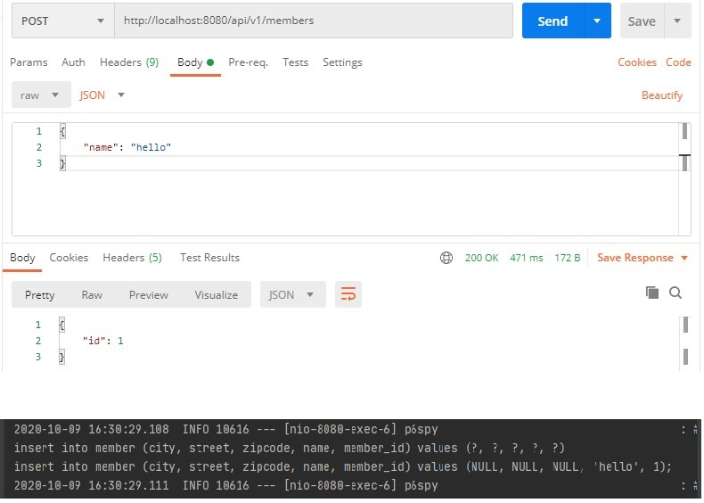
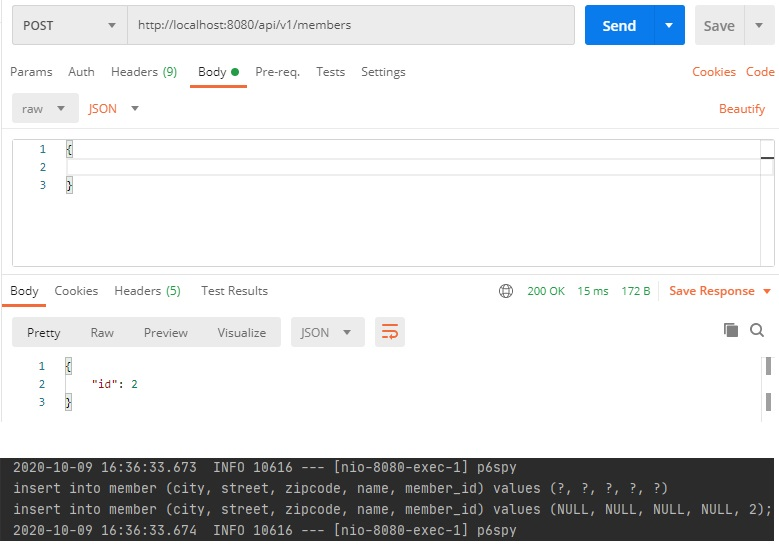
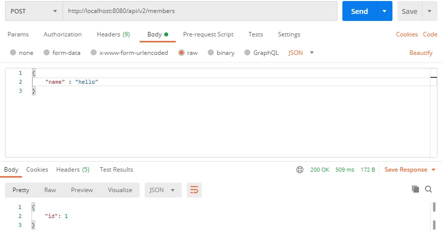
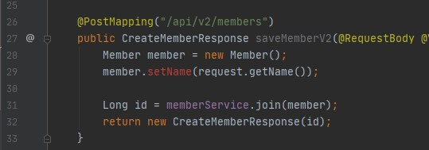
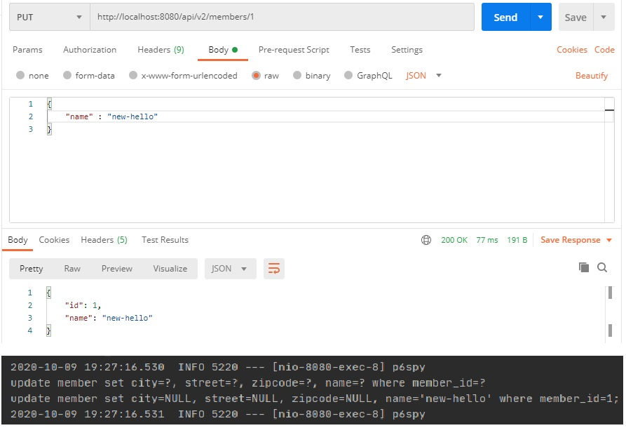
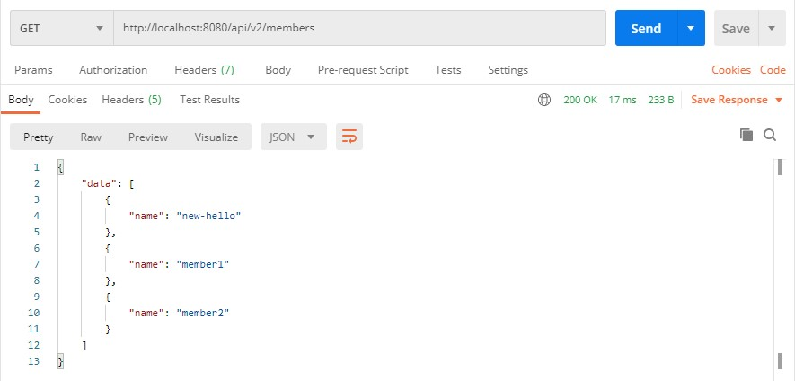

- API tool Postman 설치
    * [Postman](https://www.postman.com/downloads/)
- 참고로 화면과 api의 패키지를 분리시키는 것이 좋다.
    * 공통으로 예외처리를 할 때 패키지 등의 구성 단위로 처리를 하는 경우 많다.
    * 화면과 api는 공통 처리를 할 요소들이 다르다.
    * 화면은 문제가 생기면 공통 에러 html이 나가야 하지만 api는 공통 에러용 JSON API 스펙이 나가야 한다.

## 회원 등록 API

- api 패키지에 MemberApiController 생성
- API 생성에는 2가지 방법이 있다.
    * 엔티티
    * DTO

### 엔티티 사용 방법

- `@RequestBody`
    * 응답 데이터(XML, JSON 등)를 객체로 맵핑해서 넣어준다.

```java
@RestController
@RequiredArgsConstructor
public class MemberApiController {

    private final MemberService memberService;

    @PostMapping("/api/v1/members")
    public CreateMemberResponse saveMemberV1(@RequestBody @Valid Member member) {
        Long id = memberService.join(member);
        return new CreateMemberResponse(id);
    }

    @Data
    static class CreateMemberResponse {
        private Long id;

        public CreateMemberResponse(Long id) {
            this.id = id;
        }
    }
}
```

- 실행 후 Postman으로 확인하면 잘 저장되고 id가 1로 넘어 온 것을 볼 수 있다.
    * DB 쿼리 또한 INSERT로 잘 들어간 것을 볼 수 있다.


- Postman에서 name을 빼고 넣어도 저장이 된다.
    * Member 엔티티에서 name에 제약조건을 넣지 않았기 때문이다.


- 따라서 Member 엔티티의 name에 `@NotEmpty`를 추가하고 실행한 후 Postman에서 name을 빼고 보내면 스프링 부트가 기본으로 설정해 놓은 에러가 발생한다.
    * MemberApiController의 `@Valid` 애노테이션이 javax.validation 검증을 하기 때문이다.
    * 이름을 넣어야만 정상적으로 실행된다.


- 그러나 이 방법에는 여러가지 문제가 있다.
    * 프레젠테이션 계층을 위한 검증 로직이 엔티티에 들어가 있으면 문제가 있다.
        - 어떤 API는 `@NotEmpty`가 필요하지만 어떤 API에서는 필요없을 경우
    * 만약 엔티티의 name을 username으로 바꾼다면? API 스펙이 바뀌어 버린다.
- **따라서 결론적으로 API 스펙을 위한 DTO를 만들어야 한다.**
- API를 만들 때는 항상 엔티티를 파라미터로 받지 않는 것이 좋다.
    * 엔티티를 외부에 노출하면 안된다.

### DTO 사용 방법

```java
@RestController
@RequiredArgsConstructor
public class MemberApiController {

    private final MemberService memberService;

    @PostMapping("/api/v2/members")
    public CreateMemberResponse saveMemberV2(@RequestBody @Valid CreateMemberRequest request) {
        Member member = new Member();
        member.setName(request.getName());

        Long id = memberService.join(member);
        return new CreateMemberResponse(id);
    }

    @Data
    static class CreateMemberRequest {
        private String name;
    }
}
```

- 실행 후 Postman으로 확인하면 잘 저장되고 id도 잘 넘어온 것을 볼 수 있다.

- 첫 번째 방법의 유일한 방법은 엔티티를 쓰기 때문에 클래스를 추가로 만들지 않아도 된다는 것이다.
- DTO를 쓴다면 엔티티와 API 스펙이 명확하게 분리되어 엔티티가 변경되어도 API 스펙이 바뀌지 않는다.
    * 만약 Member엔티티의 name을 username으로 바꾼다면 컴파일 오류가 나서 알려준다.
    * `setName`을 `setUsername`으로만 바꿔주면 스펙 변화없이 끝이다.

- **API를 만들 때는 엔티티를 절대 사용하지 말고 DTO를 생성해서 사용하자!**
<br>

## 회원 수정 API

- 참고) 수정은 REST API 디자인 가이드에 따라 PUT으로 한다.
- MemberApiController에 회원 수정 API 코드 추가

```java
@RestController
@RequiredArgsConstructor
public class MemberApiController {

    private final MemberService memberService;

    ...

    // 회원 수정 API
    @PutMapping("/api/v2/members/{id}")
    public UpdateMemberResponse updateMemberV2(@PathVariable("id") Long id,
                                               @RequestBody @Valid UpdateMemberRequest request) {
        memberService.update(id, request.getName());
        Member findMember = memberService.findOne(id);
        return new UpdateMemberResponse(findMember.getId(), findMember.getName());
    }

    @Data
    static class UpdateMemberRequest {
        private String name;
    }

    @Data
    @AllArgsConstructor
    static class UpdateMemberResponse {
        private Long id;
        private String name;
    }
}
```

- MemberService에 회원 수정 코드 `update()` 추가

```java
@Service
@Transactional(readOnly = true)
@RequiredArgsConstructor
public class MemberService {

    private final MemberRepository memberRepository;

    ...

    /**
     * 회원 수정
     */
    @Transactional
    public void update(Long id, String name) {
        Member member = memberRepository.findOne(id);
        member.setName(name);
    }
}
```

- 실행해서 Postman에 회원을 등록하고 수정하면 다음과 같이 수정된 결과를 확인할 수 있다.
    * 쿼리도 UPDATE 쿼리가 나가서 수정됐다.


## 회원 조회 API

- 단순 조회이므로 데이터나 테이블을 변경할 일이 없다. 따라서 application.yml에 jpa.ddl-auto를 none으로 설정한다.
    * `ddl-auto: none`
    * 반복적으로 기능을 개선할 때마다 데이터를 넣는 것이 번거러우므로 실습 진행을 위해서 none으로 한다.
- 조회 API를 만드는 방법에는 2가지가 있다.

### 응답 값으로 엔티티를 직접 외부에 노출

```java
@RestController
@RequiredArgsConstructor
public class MemberApiController {

    private final MemberService memberService;

    ...

    // 권장되지 않는 조회 API
    @GetMapping("/api/v1/members")
    public List<Member> membersV1() {
        return memberService.findMembers();
    }
}
```

- 실행 후 조회하면 다음과 같이 회원 목록이 조회된다.

- 그러나 이 방법에는 등록 때와 마찬가지로 여러가지 문제가 있다.
    * 엔티티에 프레젠테이션 계층을 위한 로직이 추가된다.
    * 엔티티를 직접 노출하게 되면 엔티티가 가진 정보들이 모두 외부에 노출된다.
        - 그림에서도 원하지도 않았던 주문 정보가 출력된 것을 볼 수 있다.
    * 엔티티에서 원하지 않는 정보들은 `@JsonIgnore`애노테이션을 붙여 제외할 수 있지만 다른 API에서는 필요하다면?
        - 실무에서는 같은 엔티티에 대해 API가 용도에 따라 다양하게 만들어지는데, 한 엔티티에 각각의 API를 위한 프레젠테이션 응답 로직을 담기는 어렵다.
    * 엔티티가 변경되면 API 스펙이 변한다.
    * 컬렉션을 직접 반환하면 항후 API 스펙을 변경하기 어렵다
- **엔티티는 최대한 건드리지 말자!**
- 따라서 등록 때와 마찬가지로 별도의 DTO를 사용하자.

### 응답 값으로 엔티티가 아닌 별도의 DTO 사용

- 엔티티를 DTO로 변환해서 반환한다.
- 엔티티가 변해도 API 스펙이 변경되지 않는다.
- 추가로 Result 클래스로 컬렉션을 감싸서 향후 필요한 필드를 추가할 수 있다.

```java
@RestController
@RequiredArgsConstructor
public class MemberApiController {

    private final MemberService memberService;

    ...

    // 회원 조회 API
    @GetMapping("/api/v2/members")
    public Result membersV2() {
        List<Member> findMembers = memberService.findMembers();
        //엔티티 -> DTO 변환
        List<MemberDto> collect = findMembers.stream()
                .map(m -> new MemberDto(m.getName()))
                .collect(Collectors.toList());
        return new Result(collect);
    }

    @Data
    @AllArgsConstructor
    static class Result<T> {
        private T data;
    }
    @Data
    @AllArgsConstructor
    static class MemberDto {
        private String name;
    }
}
```

- 실행 후 조회하면 다음과 같이 DTO가 감싸고 있고 name만 조회되었다.


### Links

[실전! 스프링 부트와 JPA 활용2 - API 개발과 성능 최적화](https://www.inflearn.com/course/%EC%8A%A4%ED%94%84%EB%A7%81%EB%B6%80%ED%8A%B8-JPA-API%EA%B0%9C%EB%B0%9C-%EC%84%B1%EB%8A%A5%EC%B5%9C%EC%A0%81%ED%99%94/dashboard)
