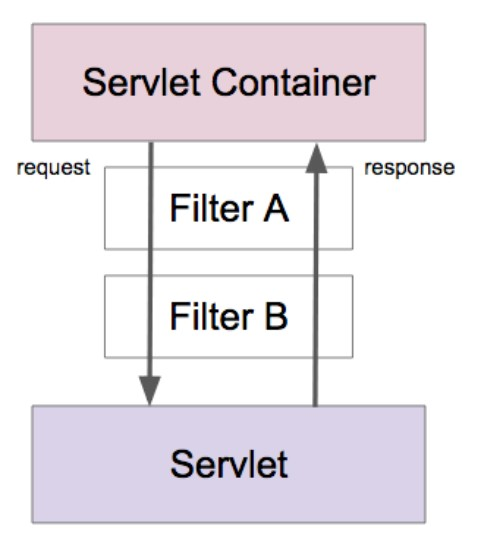
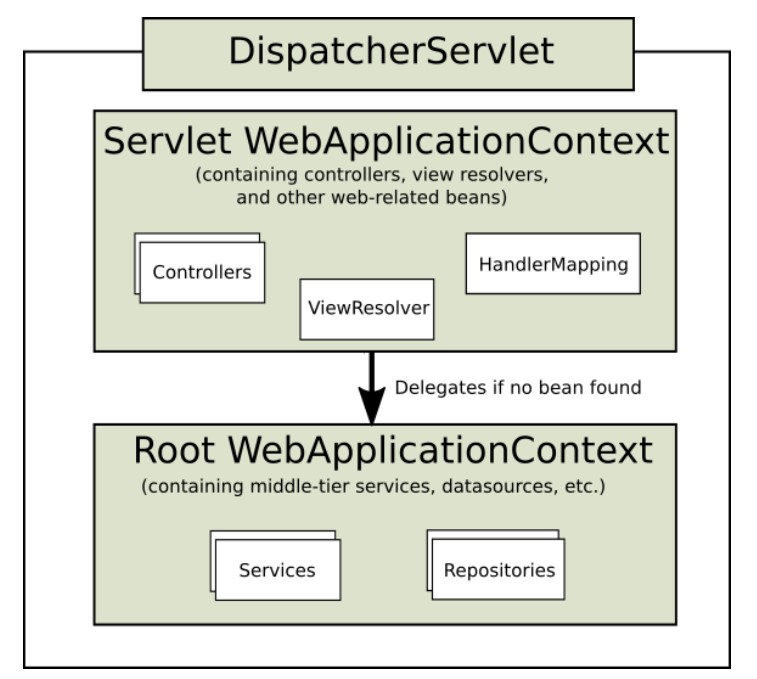

# 스프링 MVC 동작 원리

## 스프링 MVC 소개

### MVC

- Model : 도메인 객체 또는 DTO로 화면에 전달할 또는 화면에서 전달 받은 데이터를 담고 있는 객체로 평범한 자바 객체 POJO이다.
- View : 데이터를 보여주는 역할. 다양한 형태로 보여줄 수 있다. HTML, JSON, XML, ...
- Controller
	* 사용자 입력을 받아 모델 객체의 데이터를 변경하거나, 모델 객체를 뷰에 전달하는 역할 (스프링 @MVC)
	* 입력값 검증
	* 변경된 모델 객체를 뷰에 전달

### MVC 패턴의 장점

- 동시 다발적(Simultaneous) 개발 : 백엔드 개발자와 프론트엔드 개발자가 독립적으로 개발을 진행할 수 있다.
- 높은 결합도 : 논리적으로 관련있는 기능을 하나의 컨트롤러로 묶거나, 특정 모델과 관련있는 뷰를 그룹화 할 수 있다.
- 낮은 의존도 : 뷰, 모델, 컨트롤러는 각각 독립적이다.
- 개발 용이성 : 책임이 구분되어 있어 코드 수정하는 것이 편하다.
- 한 모델에 대한 여러 형태의 뷰를 가질 수 있다.

### MVC 패턴의 단점

- 코드 네비게이션 복잡하다.
- 코드 일관성 유지에 노력이 필요하다.
- 높은 학습 곡선

## Servlet

- 스프링 MVC는 Servlet기반의 웹 애플리케이션을 쉽게 만들 수 있게 도와주는 프레임워크이다.

### Servlet 이란

- 자바 엔터프라이즈 에디션은 웹 애플리케이션 개발용 스팩과 API 제공한다.
- 한 요청에 처리할 때마다 새로운 프로세스를 만들고 죽이는 식이 아니라 한 프로세스 내의 자원을 공유하는 쓰레드(만들거나, 풀에서 가져다가)가 요청을 처리한다.
- 가장 중요한 클래스중 하나가 HttpServlet.
- Servlet 등장 이전에 사용하던 기술인 CGI (Common Gateway Interface)
	- 요청 당 프로세스를 만들어 사용

### Servlet의 장점 (CGI에 비해)

- 빠르다.
- 플랫폼 독립적이다.
- 보안성이 좋다.
- 이식성이 좋다.

### Servlet 엔진 또는 Servlet 컨테이너 (Tomcat, Jetty, Undertow, ...)

- 세션 관리
- 네트워크 서비스
- MIME 기반 메시지를 인코딩 또는 디코딩
- Servlet 생명주기 관리 등등

### Servlet 생명주기

- Servlet 컨테이너가 Servlet 인스턴스의 `init()` 메소드를 호출하여 초기화 한다.
	* 최초 요청을 받았을 때 한번 초기화 하고 나면 그 다음 요청부터는 이 과정을 생략한다.
- Servlet이 초기화 된 다음부터 클라이언트의 요청을 처리할 수 있다. 각 요청은 별도의 쓰레드로 처리하고 이때 Servlet 인스턴스의 `service()` 메소드를 호출한다.
	* 이 안에서 HTTP 요청을 받고 클라이언트로 보낼 HTTP 응답을 만든다.
	* `service()`는 보통 HTTP Method에 따라 `doGet()`, `doPost()` 등으로 처리를 위임한다.
	* 따라서 보통 `doGet()` 또는 `doPost()`를 구현한다.
- Servlet 컨테이너 판단에 따라 해당 Servlet을 메모리에서 내려야 할 시점에 `destroy()`를 호출한다.

## Servlet 리스너와 Servlet 필터

### Servlet 리스너

- 웹 애플리케이션에서 발생하는 주요 이벤트를 감지하고 각 이벤트에 특별한 작업이 필요한 경우에 사용할 수 있다.
	* Servlet 컨텍스트 수준의 이벤트
		- 컨텍스트 라이프사이클 이벤트
		- 컨텍스트 애트리뷰트 변경 이벤트
	* 세션 수준의 이벤트
		- 세션 라이프사이클 이벤트
		- 세션 애트리뷰트 변경 이벤트

### Servlet 필터

- 들어온 요청을 Servlet으로 보내고, 또 Servlet이 작성한 응답을 클라이언트로 보내기 전에 특별한 처리가 필요한 경우에 사용할 수 있다.
- Servlet 필터를 사용하면 여러 개의 Servlet에 추가적인 작업을 할 수 있고, 특정한 url 패턴에도 작업을 추가로 할 수 있다.
- 동시다발적으로 적용되는 것이 아니라 체인 형태의 구조로 순차적으로 적용된다.


## Servlet 애플리케이션에 스프링 연동하는 방법

### 1. 스프링 IoC 컨테이너 연동

- spring-mvc 의존성 추가

```xml
<dependency>
    <groupId>org.springframework</groupId>
    <artifactId>spring-webmvc</artifactId>
    <version>5.2.6.RELEASE</version>
</dependency>
```

- web.xml에 ContextLoaderListener 추가
	* ApplicationContext 생성
	* Servlet 생명주기에 맞춰 ApplicationContext가 실행되도록 한다.

```xml
<listener>
    <listener-class>org.springframework.web.context.ContextLoaderListener</listener-class>
</listener>
```

- 스프링 설정 파일 생성 및 위치 설정
	* ApplicationContext를 만들기 위해서는 스프링 설정 파일이 필요하다.

```java
// 스프링 설정 파일
@Configuration
@ComponentScan
public class AppConfig {

}
```

```java
// ApplicationContext에 들어갈 bean
@Service
public class HelloService {

    public String getName() {
        return "kimhayoung";
    }
}
```

- web.xml에 context-param 추가

```xml
<context-param>
    <param-name>contextClass</param-name>
    <param-value>org.springframework.web.context.support.AnnotationConfigWebApplicationContext</param-value>
</context-param>

<context-param>
    <param-name>contextConfigLocation</param-name>
    <param-value>me.hayoung.AppConfig</param-value>
</context-param>
```

- Servlet 파일에서 ApplicationContext를 생성하여 사용

```java
public class HelloServlet extends HttpServlet {

    @Override
    public void init() throws ServletException {
        System.out.println("init");
    }

    @Override
    protected void doGet(HttpServletRequest req, HttpServletResponse resp) throws ServletException, IOException, IOException {
        System.out.println("doGet");
        
        ApplicationContext context = (ApplicationContext) getServletContext().getAttribute(WebApplicationContext.ROOT_WEB_APPLICATION_CONTEXT_ATTRIBUTE);
        HelloService helloService = context.getBean(HelloService.class);
        
        resp.getWriter().println("<html>");
        resp.getWriter().println("<head>");
        resp.getWriter().println("<body>");
        resp.getWriter().println("<h1>Hello, " + helloService.getName() + "</h1>");
        resp.getWriter().println("</body>");
        resp.getWriter().println("</head>");
        resp.getWriter().println("</html>");
    }

    @Override
    public void destroy() {
        System.out.println("destroy");
    }
}
```

### 2. 스프링 MVC 연동


- 스프링이 제공하는 Servlet 구현체 DispatcherServlet을 사용하는 방법
- Root WebApplicationContext를 상속받는 ApplicationContext(Servlet WebApplicationContext)를 하나 더 만든다.
	* Root WebApplicationContext는 다른 Servlet도 공용으로 사용가능
	* DispatcherServlet 내부에서 만드는 ApplicationContext는 다른 DispatcherServlet에서 사용 불가능
- web.xml에 DispatcherServlet 등록

```xml
<servlet>
    <servlet-name>app</servlet-name>
    <servlet-class>org.springframework.web.servlet.DispatcherServlet</servlet-class>
</servlet>
```

- Controller를 만들어 DispatcherServlet이 만드는 ApplicationContext에 등록

```java
@RestController
public class HelloController {

    @Autowired
    HelloService helloService;

    @GetMapping("/hello")
    public String hello() {
        return "Hello, " + helloService.getName();
    }
}
```

- HelloController는 DispatcherServlet이 만드는 ApplicationContext에 등록하고, HelloService는 ContextLoaderListener가 만드는 ApplicationContext에 등록

```java
@Configuration
// Controller는 bean으로 등록하지 않도록 설정
@ComponentScan(excludeFilters = @ComponentScan.Filter(Controller.class))
public class AppConfig {

}
```

```java
@Configuration
// Default 필터들을 사용하지 않고, Controller만 bean으로 등록하도록 설정
@ComponentScan(useDefaultFilters = false, includeFilters = @ComponentScan.Filter())
public class WebConfig {
}
```

- web.xml에서 contextClass를 변경

```xml
<servlet>
    <servlet-name>app</servlet-name>
    <servlet-class>org.springframework.web.servlet.DispatcherServlet</servlet-class>
    <init-param>
        <param-name>contextClass</param-name>
        <param-value>org.springframework.web.context.support.AnnotationConfigWebApplicationContext</param-value>
    </init-param>
    <init-param>
        <param-name>contextConfigLocation</param-name>
        <param-value>me.hayoung.WebConfig</param-value>
    </init-param>
</servlet>

<servlet-mapping>
    <servlet-name>app</servlet-name>
    <url-pattern>/app/*</url-pattern>
</servlet-mapping>
```

#### 만약 web.xml이 복잡하고 여러 Servlet을 등록하지 않을 경우

- 계층 구조를 만들 필요없이 DispatcherServlet에서 만드는 ApplicationContext에 모든 bean을 등록할 수 있다.
- 위의 예시 코드에서 AppConfig를 삭제하고 WebConfig의 Filter를 삭제
	* Controller와 Service가 모두 WebConfig에 의해서 ApplicationContext에 등록된다.
	* 이렇게 되면 Root WebApplicationContext가 있지 않고 DispatcherServlet이 만드는 WebApplicationContext(모든 bean이 여기 등록)가 루트가 된다.
- 최근에는 대부분 상속구조보다는 DispatcherServlet 하나만 등록되어 있고 DispatcherServlet이 만든 ApplicationContext에 모든 bean이 등록되어 동작하는 방식을 사용한다.

#### 스프링 부트에서는?

- 현재는 servlet container가 먼저 뜨고 안에 등록되는 servlet application에 spring을 연동하는 방법이고
- 스프링 부트에서는 스프링 부트 자바 애플리케이션이 먼저 뜨고 그 안에 톰캣이 내장 서버로 뜬다.
- 부트에서는 servlet을 코드로 등록한다.
- 즉 위의 방법은 톰캣 안에 스프링을 넣은 형태이고 부트에서는 애플리케이션 안에 톰캣을 넣은 것이라고 생각하면 된다.

## DispatcherServlet

### DispatcherServlet 초기화

- 다음의 특별한 타입의 빈들을 찾거나, 기본 전략에 해당하는 빈들을 등록한다.
- HandlerMapping: 핸들러를 찾아주는 인터페이스
- HandlerAdapter: 핸들러를 실행하는 인터페이스
- HandlerExceptionResolver
- ViewResolver
- ...

### DispatcherServlet 동작 순서

1. 요청을 분석한다. (로케일, 테마, 멀티파트 등)
2. (핸들러 맵핑에게 위임하여) 요청을 처리할 핸들러를 찾는다.
3. (등록되어 있는 핸들러 어댑터 중에) 해당 핸들러를 실행할 수 있는 “핸들러 어댑터”를 찾는다.
4. 찾아낸 “핸들러 어댑터”를 사용해서 핸들러의 응답을 처리한다.
	- 핸들러의 리턴값을 보고 어떻게 처리할지 판단한다.
		* 뷰 이름에 해당하는 뷰를 찾아서 모델 데이터를 랜더링한다.
		* @ResponseEntity가 있다면 Converter를 사용해서 응답 본문을 만들고.
5. (부가적으로) 예외가 발생했다면, 예외 처리 핸들러에 요청 처리를 위임한다.
6. 최종적으로 응답을 보낸다.

## 스프링 MVC 구성 요소

### DispatcherServlet이 사용하는 인터페이스

- DispatcherSerlvet의 기본 전략
	* DispatcherServlet.properties
- MultipartResolver
	* 파일 업로드 요청 처리에 필요한 인터페이스
	* HttpServletRequest를 MultipartHttpServletRequest로 변환해주어 요청이 담고 있는 File을 꺼낼 수 있는 API 제공.
- LocaleResolver
	* 클라이언트의 위치(Locale) 정보를 파악하는 인터페이스
	* 기본 전략은 요청의 accept-language를 보고 판단.
- ThemeResolver
	* 애플리케이션에 설정된 테마를 파악하고 변경할 수 있는 인터페이스
- HandlerAdapter
	* HandlerMapping이 찾아낸 “핸들러”를 처리하는 인터페이스
	* 스프링 MVC 확장력의 핵심
- HandlerExceptionResolver
	* 요청 처리 중에 발생한 에러를 처리하는 인터페이스
- RequestToViewNameTranslator
	* 핸들러에서 뷰 이름을 명시적으로 리턴하지 않은 경우, 요청을 기반으로 뷰 이름을 판단하는 인터페이스
- ViewResolver
	* 뷰 이름(string)에 해당하는 뷰를 찾아내는 인터페이스
- FlashMapManager
	* FlashMap 인스턴스를 가져오고 저장하는 인터페이스
	* FlashMap은 주로 리다이렉션을 사용할 때 요청 매개변수를 사용하지 않고 데이터를 전달하고 정리할 때 사용한다.
	* ex) `redirect:/events/id=2020`

## 스프링 부트와 스프링 MVC

### 스프링 부트를 사용하지 않는 스프링 MVC

- 서블릿 컨네이너(ex : tomcat)에 등록한 웹 애플리케이션(WAR)에 DispatcherServlet을 등록한다.
	* web.xml에 서블릿 등록
	* 또는 WebApplicationInitializer에 자바 코드로 서블릿 등록 (스프링 3.1+, 서블릿 3.0+)
- 세부 구성 요소는 빈 설정하기 나름.

### 스프링 부트를 사용하는 스프링 MVC

- 자바 애플리케이션에 내장 톰캣을 만들고 그 안에 DispatcherServlet을 등록한다
	* 스프링 부트 자동 설정이 자동으로 해줌.
- 스프링 부트의 주관에 따라 여러 인터페이스 구현체를 빈으로 등록한다.
