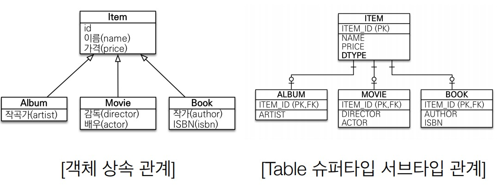
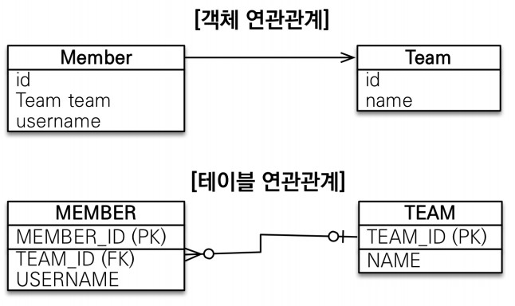
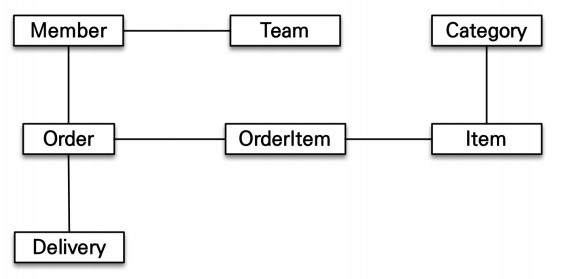
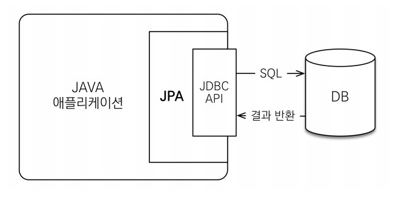
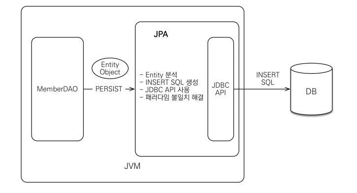
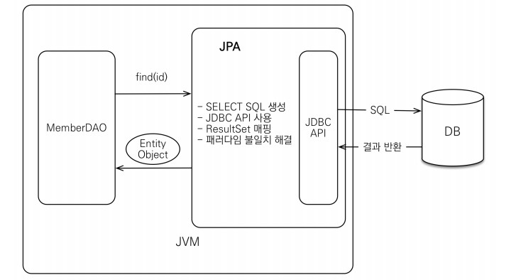

# JPA 소개

## SQL 중심적인 개발의 문제점

- 현재 데이터베이스는 관계형 DB(Oracle, MySQL, ...)가 주도하고 있다.

### 무한 반복과 지루한 코드

- table을 만들 때마다 SQL을 반복해서 짜야한다.
- 예를 들어 회원 table을 만들 때 다음과 같이 회원 객체와 쿼리를 짰을 경우

```java
public class Member {
    private String memberId;
    private String name;
    // ...
}
```

```sql
INSERT INTO MEMBER(MEMBER_ID, NAME) VALUES ...
SELECT MEMBER_ID, NAME FROM MEMBER M
UPDATE MEMBER SET ...
```

- 연락처 column을 추가해야 한다면 다음과 같이 다 수정해야 한다.

```java
public class Member {
    private String memberId;
    private String name;
    private String tel;
    // ...
}
```

```sql
INSERT INTO MEMBER(MEMBER_ID, NAME, TEL) VALUES ...
SELECT MEMBER_ID, NAME, TEL FROM MEMBER M
UPDATE MEMBER SET ... TEL = ?
```

- **결국, 우리가 관계형 DB를 쓰는 상황에서는 SQL에 의존적인 개발을 피하기 어렵다.**

### 패러다임의 불일치 문제

- 애초에 관계형 DB 사상과 객체지향의 사상이 다르다
	* 관계형 DB는 데이터를 정규화해서 보관을 하는것이 목표이고
	* 객체지향은 field와 method를 묶어서 캡슐화하는것이 목표이다.
- 객체를 영구 보관하는 다양한 저장하는 방법으로 RDB, NoSQL, File 등 많은 방법이 있지만 현실적인 대안은 관계형 DB이다.
- **따라서 현재 객체를 SQL로 바꾸는 일에 개발자가 많은 시간을 쏟고 있다.**

### 객체와 관계형 DB의 차이

#### 상속

- 객체에는 상속 관계가 있지만 관계형 DB에는 상속 관계가 없다.
- 객체의 상속 관계와 그나마 유사한 것이 Table의 슈퍼타입-서브타입 관계라는 논리 모델이다.
- 예를 들어 다음과 같이 객체와 table을 설계했다고 했을 때

- Album 객체를 저장하는 경우
	* Item을 상속받았으므로 Album이 데이터를 다 가지고 있다.
	* DB에 저장하려면 INSERT 쿼리를 2번 작성해야 한다.
		- `INSERT INTO ITEM ...`, `INSERT INTO ALBUM ...`
- Album을 조회하고 싶은 경우
	* 각각의 테이블에 따른 조인 SQL을 작성하고 각각의 객체 생성해서 필드에 넣어주고... 매우 복잡하다.
- 만약 DB가 아니라 자바 컬렉션을 사용한다면? 매우 단순해 진다.
	* 저장할 때는 `list.add(album);`
	* 조회할 때는 `Album album = list.get(albumId);`
	* 필요하다면 부모 타입으로 조회 후 다형성을 활용할 수있다.
		- `Item item = list.get(albumId);`

#### 연관관계


- 객체는 참조를 사용한다.
	* 객체는 **단방향**으로, Member에서 Team으로 갈 수 있지만 Team에서 Member로 갈 수 없다.
- 테이블은 외래 키를 사용한다.
	* FK와 PK를 조인해서 조회한다.
	* 테이블은 **양방향**으로, 반대로 조인도 가능하다.

##### 객체를 테이블에 맞춰 모델링할 경우

- FK가 그대로 필드로 포함된다.

```java
class Member {
    String id;        //MEMBER_ID (PK)
    Long teamId;      //TEAM_ID (FK) 
    String username;  //USERNAME
}
```

```java
class Team {
    Long id;    // TEAM_ID (PK)
    String name;// NAME 
}
```

- DB 삽입 : 쿼리에는 필드들을 맵핑해서 넣으면 된다.

```sql
INSERT INTO MEMBER(MEMBER_ID, TEAM_ID, USERNAME) VALUES ...
```

##### 객체 중심으로 모델링할 경우

- Team이라는 객체 자체를 포함하고 있어서 Member객체에서 Team을 바로 접근할 수 있다.
- 좀 더 객체지향적이다.

```java
class Member {
    String id;
    Team team;  // 참조로 연관관계를 맺는다.
    String username;
}
```

```java
class Team {
    Long id;
    String name;
}
```

- DB 삽입 : 쿼리를 작성할 때 TEAM_ID 대신 Team의 참조값이 있기 때문에 `member.getTeam().getId();` teamId를 조회해서 넣는다.

```sql
INSERT INTO MEMBER(MEMBER_ID, TEAM_ID, USERNAME) VALUES ...
```

- 객체 모델링 조회
	* **조회의 경우 문제가 생긴다.**
	* Member와 Team을 조인하고 데이터를 SQL로 한번에 불러온 다음 섞여있는 데이터를 따로 나눠 세팅한 뒤에 반환한다.
	* 매우 번거롭다.

```sql
SELECT M.*, T.*
FROM MEMBER M
JOIN TEAM T ON M.TEAM_ID = T.TEAM_ID
```

```java
public Member find(Strubg memberId) {
  // SQL 실행 ...
  Member member = new Member();
  // DB에서 조회한 회원 관련 정보를 모두 입력
  Team team = new Team();
  // DB에서 조회한 팀 관련 정보를 모두 입력
  
  // 회원과 팀 관계 설정
  member.setTeam(team);
  return member;
}
```

- 객체 모델링을 자바 컬렉션에서 관리할 경우 매우 간단하다.
	* member를 저장하면, Team도 같이 저장된다.
		- `list.add(member);`
	* member가 필요하면
		- `Member member = list.get(memberId);`
	* Team 조회
		- `Team team = member.getTeam();`
	* DB에 넣는 순간 중간에 복잡한 일을 개발자가 해야하기 때문에 생산성이 떨어진다.

### 객체 그래프 탐색



- 객체는 자유롭게 객체 그래프를 탐색할 수 있어야 한다.
	* 예를 들어, `member.getOrder()`,`member.getTeam()`와 같이 호출할 수 있어야 한다.
- 하지만 **처음 실행하는 SQL에 따라 탐색 범위가 결정**되버리기 때문에 마음껏 호출할 수 없다.
	* 예를 들어 다음과 같이 처음에 Member와 Team만 가져와서 값을 채워넣고 반환했을 때
	* `member.getTeam();`은 괜찮지만 `member.getOrder();`는 처음 SQL 실행할 때 쿼리에서 Order를 가져오지 않았기 때문에 member 필드안에 order가 있더라도 getOrder()는 NULL이다.

```sql
SELECT M.*, T.*
FROM MEMBER M
JOIN TEAM T ON M.TEAM_ID = T.TEAM_ID
```

```java
member.getTeam(); // OK
member.getOrder(); // null
```

- 결국 엔티티에 대한 신뢰 문제가 발생한다.

### 엔티티 신뢰 문제

- 만약 다음 코드와 같이 비즈니스 로직이 있고 memberDAO를 다른 사람이 개발 했다고 가정했을 때 memberDAO안에서 어떤 쿼리가 날라가고 어떻게 데이터를 조립했는지를 눈으로 확인하지 않는 이상 **반환된 엔티티를 신뢰하고 사용할 수 없다.**

```java
class MemeberService {
    // ...
    
    public void process() {
  	    Member member = memberDAO.find(memberId);
        member.getTeam();
        member.getOrder().getDelivery();
    }
}
```

- 물리적으로는 나눠져있지만 논리적으로는 엮여있다고 보는게 맞다.
	* dependency가 좋지 않다.
- 그렇다고 모든 객체를 미리 로딩할 수는 없다.
	* 따라서 대안으로 선택하는 것이 다음과 같은 방법들이 있다.
		- `getMember();` member만 조회
		- `getMemberWithTeam();` Member와 Team을 조회
		- `getMemberWithOrderWithDelivery();` Member,Order,Delivery를 조회
	* 이렇게 **SQL을 직접 다루게 되면, 진정한 의미의 계층 분할이 어렵다.**

### 비교하기

- 일반적인 SQL을 사용하는 경우
	* 식별자가 같아도 쿼리를 2번 날릴 때 new Member로 생성하므로 다르다.

```java
String memberId = "100";
Member member1 = memberDAO.getMember(memberId);
Member member2 = memberDAO.getMember(memberId);

member1 == member2; //다르다
```

```java
class MemberDAO {
  public Member getMember(String memberId) {
    String sql = "SELECT * FROM MEMBER WHERE MEMBER_ID = ?";
  	...
    // JDBC API, SQL 실행
    return new Member(...);
  }
}
```

- 자바 컬렉션에서 조회할 경우

```java
String memberId = "100";
Member member1 = memberDAO.getMember(memberId);
Member member2 = memberDAO.getMember(memberId);

member1 == member2; // 같다.
```

- 결론적으로 객체지향적으로 모델링 할수록 맵핑 작업만 늘어나고 힘들다.
- 객체를 자바 컬렉션에 저장하듯이 DB에 저장할 수는 없을까? 라는 고민의 결과가 JPA이다.

## JPA란

- Java Persistence API의 약자로 자바 진영의 ORM 기술 표준이다.
- ORM?
	* Object-relational mapping(객체 관계 매핑)
	* 객체는 객체지향답게 설계하고 관계형 데이터베이스는 관계형 데이터베이스 답게 설계를 한 뒤, 중간에서 ORM 프레임워크가 중간에서 매핑 해준다.
	* 대중적인 언어에는 대부분 ORM 기술이 존재한다.

### JPA 소개

- EJB
	* 과거의 자바 표준 (Entity Bean)
	* 단점
		- 인터페이스를 많이 구현해야 한다.
		- 속도가 느리다.
		- 동작하지 않는 기능이 있다.
		- 성능이 나쁘다.
- Hibernate
	* 'Gavin King'이라는 사람이 개발한 오픈 소스 ORM 프레임 워크
	* EJB의 단점 때문에 만들었다.
- JPA (Java Persistence API)
	* 현재 자바 진영의 ORM 기술 표준
	* 인터페이스의 모음으로 실제로 동작하는 것이 아니다.
	* JPA 2.1 표준 명세를 구현한 3가지 구현체: Hibernate, EclipseLink, DataNucleus

### JPA의 동작



- JPA는 애플리케이션과 JDBC 사이에서 동작한다.
- 개발자가 직접 JDBC API를 사용하는 것이 아니라 JPA에게 명령하면 JPA가 JDBC API를 사용해서 SQL을 호출하고 결과를 받아서 동작한다.

#### 저장


- memberDAO에서 객체를 저장하고 싶은 경우
	* JPA에게 Member객체를 넘기면 JPA가 객체를 분석한다.
	* JPA가 적절한 INSERT 쿼리 생성한다.(**개발자가 쿼리를 작성하는 것이 아니라 JPA가 만들어준다.** )
	* JPA가 JDBC API를 사용해서 INSERT 쿼리를 DB에 보낸다.
	* **패러다임의 불일치 해결**

#### 조회


- JPA에게 PK값으로 find 요청하면 JPA는 SELECT 쿼리를 만든다.
- JDBC API를 통해 DB에 보내고 결과를 받는다.
- ResultSet 결과를 가지고 객체에 맵핑을 해준다.
- **패러다임 불일치 해결**

### JPA를 사용해야 하는 이유

#### 생산성

- CRUD 코드가 이미 만들어져 있다.
- 저장
	* `jpa.persist(member)`
- 조회
	* `Member member = jpa.find(memberId)`
- 수정
	* `member.setName("변경할 이름")`
- 삭제
	* `jpa.remove(member)`

#### 유지보수

- 기존에는 필드 변경 시 모든 SQL을 수정해야 하지만 JPA에서는 필드만 추가하면 SQL은 JPA가 처리한다.

#### 패러다임 불일치 해결

- 관계형 DB와 객체의 패러다임 불일치를 해결해 준다.

**JPA와 상속**


- 저장
	* 개발자가 할 일

```java
jpa.persist(album);
```

* 나머지는 JPA가 처리한다.
	- JPA가 INSERT 쿼리를 2개(Album과 ITEM)로 쪼개서 만든다.

```sql
INSERT INTO ITEM ...
INSERT INTO ALBUM ...
```

- 조회
	* 개발자가 할 일

```java
Album album = jpa.find(Album.class, albumId);
```

* 나머지는 JPA가 처리한다.
	- ITEM과 ALBUM을 조인해서 데이터를 가져온다.

```sql
SELECT I.*, A.*
FROM ITEM I
JOIN ALBUM A ON I.ITEM_ID = A.ITEM_ID
```

**연관관계, 객체 그래프 탐색**

- 연관관계 저장

```java
member.setTeam(team);
jpa.persist(member);
```

- 객체 그래프 탐색

```java
Member member = jpa.find(Member.class, memberId);
Team team = member.getTeam();
```

- 위와 같이 코드를 작성하면 마치 자바 컬렉션에 넣은 것처럼 꺼내올 수 있다.
- 신뢰할 수 있는 엔티티
	* JPA를 통해서 객체를 가져왔다면 객체 그래프를 자유롭게 탐색할 수 있다.

```java
class MemberService { 
    //...
    public void process() { 
        /* 직접 구현한 DAO에서 객체를 가져온 경우 */
        Member member1 = memberDAO.find(memberId); 
        member1.getTeam(); // 엔티티를 신뢰할 수 없음 
        member1.getOrder().getDelivery(); 

        /* JPA를 통해서 객체를 가져온 경우 */
        Member member2 = jpa.find(Member.class, memberId); 
        member2.getTeam(); // 자유로운 객체 그래프 탐색
        member2.getOrder().getDelivery(); 
      } 
}
```

**비교하기**

- JPA는 같은 트랜잭션에서 조회한 엔티티는 같음을 보장한다.

```java
String memberId = "100";
Member member1 = jpa.find(memberId);
Member member2 = jpa.find(memberId);

member1 == member2; //같다.
```

#### JPA의 성능 최적화 기능

- 무엇이든 계층 사이에 중간 계층이 있는 경우 항상 모아서 쏘는 버퍼링과 읽을 때 캐싱이 가능하다.
	* 따라서 중간 계층에 해당하는 JPA를 잘 다루면 성능을 끌어올릴 수 있다.

**1차 캐시와 동일성 보장**
- 같은 트랜잭션 안에서는 같은 엔티티를 반환한다. (약간의 조회 성능이 향상된다.)
	* 처음에는 SQL로 실행하고 2번째는 캐싱하고 있다가 1번째를 그대로 반환해준다.(굉장히 짧은 시간의 캐싱)
	* 결과적으로 SQL이 1번만 실행된다.

```java
String memberId = "100";
Member member1 = jpa.find(memberId); // SQL
Member member2 = jpa.find(memberId); // 캐시

member1 == member2; //같다.
```

- DB Isolation Level이 Read Commit이어도 애플리케이션에서 Repeatable Read를 보장한다.

**트랜잭션을 지원하는 쓰기 지연(버퍼링 기능)**

- 쿼리를 모아서 보내려면 JDBC BATCH 기능을 쓰면 되는데 코드가 굉장히 복잡해진다.
- JPA를 사용하면 옵션을 사용해서 간단하게 모아서 보낼 수 있다.
	* 메모리에 쌓았다가 트랜잭션이 커밋되는 순간 한번에 네트워크를 통해서 보낸다.
- 모으지 않으면 네트워크 3번 타고, 쿼리를 3번 날린다.

```java
transcation.begin(); // 트랜잭션 시작

em.persist(memberA);
em.persist(memberA);
em.persist(memberA);
// 여기까지 INSERT SQL을 DB에 보내지 않는다.

// 커밋하는 순간 DB에 모아놨던 SQL을 한번에 보낸다.
transction.commit(); // 트랜잭션 커밋
```

**지연 로딩과 즉시 로딩**

- JPA에 옵션이 있어서 간단하게 설정할 수 있다.
- 지연 로딩 : 객체가 실제 사용될 때 로딩

```java
Member member = memberDAO.find(memberId);  // SELECT * FROM MEMBER
Team team = member.getTeam();
String teamName = team.getName();  //SELECT * FROM TEAM, 실제 필요할 때 로딩한다.
```

- 즉시 로딩 : JOIN SQL로 한번에 연관된 객체까지 미리 조회

```java
Member member = memberDAO.find(memberId);  // SELECT M.*, T.* FROM MEMBER JOIN TEAM ...
Team team = member.getTeam();
String teamName = team.getName();
```
