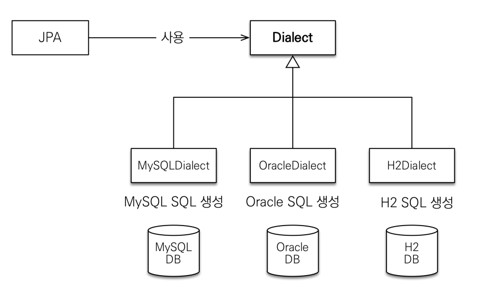
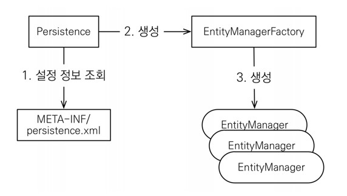
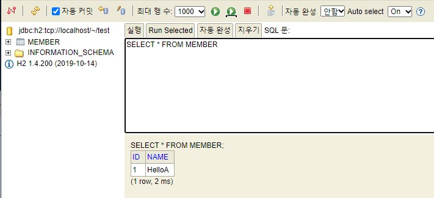

# JPA 시작하기

## JPA 프로젝트 생성

### H2 데이터베이스 설치

- [H2 데이터 베이스](https://www.h2database.com/html/main.html)
	* 최고의 실습용 DB로 가볍다(1.5MB)
	* 웹용 쿼리툴 제공
	* MySQL, Oracle 데이터베이스 시뮬레이션 기능
	* Sequence, AUTO INCREMENT 기능 지원

### 인텔리제이에서 Maven 프로젝트 생성 후 pom.xml에 의존성 추가

- Java 8 이상 권장

```xml
<?xml version="1.0" encoding="UTF-8"?>
<project xmlns="http://maven.apache.org/POM/4.0.0"
         xmlns:xsi="http://www.w3.org/2001/XMLSchema-instance"
         xsi:schemaLocation="http://maven.apache.org/POM/4.0.0 http://maven.apache.org/xsd/maven-4.0.0.xsd">
    <modelVersion>4.0.0</modelVersion>

    <groupId>jpa-basic</groupId>
    <artifactId>ex1-hello-jpa</artifactId>
    <version>1.0.0</version>

    <dependencies>
        <!-- JPA 하이버네이트 -->
        <dependency>
            <groupId>org.hibernate</groupId>
            <artifactId>hibernate-entitymanager</artifactId>
            <version>5.4.20.Final</version>
        </dependency>
        <!-- H2 데이터베이스 -->
        <dependency>
            <groupId>com.h2database</groupId>
            <artifactId>h2</artifactId>
            <version>1.4.200</version>
        </dependency>
    </dependencies>
    
</project>
```

### JPA 설정하기 - persistence.xml

- jpa 설정 파일
- 위치 : /META-INF/persistence.xml
- javax.persistence로 시작 : JPA 표준 속성
- hibernate로 시작 : 하이버 네이트 전용 속성

```xml
<?xml version="1.0" encoding="UTF-8"?>
<persistence version="2.2"
             xmlns="http://xmlns.jcp.org/xml/ns/persistence"
             xmlns:xsi="http://www.w3.org/2001/XMLSchema-instance"
             xsi:schemaLocation="http://xmlns.jcp.org/xml/ns/persistence http://xmlns.jcp.org/xml/ns/persistence/persistence_2_2.xsd">

  <!-- 데이터베이스당 1개 작성 -->
  <persistence-unit name="hello">
    <properties>
      <!-- 필수 속성 -->
      <!-- JPA 표준 -->
      <property name="javax.persistence.jdbc.driver" value="org.h2.Driver"/>
      <property name="javax.persistence.jdbc.user" value="sa"/>
      <property name="javax.persistence.jdbc.password" value=""/>
      <property name="javax.persistence.jdbc.url" value="jdbc:h2:tcp://localhost/~/test"/>

      <!-- Hibernate 전용 설정(방언 설정) -->
      <property name="hibernate.dialect" value="org.hibernate.dialect.H2Dialect"/>

      <!-- 옵션 -->
      <property name="hibernate.show_sql" value="true"/>
      <property name="hibernate.format_sql" value="true"/>
      <property name="hibernate.use_sql_comments" value="true"/>
      <!--<property name="hibernate.hbm2ddl.auto" value="create" />-->
    </properties>
  </persistence-unit>
</persistence>
```

### 데이터베이스 방언(Dialect)


- 방언 : SQL 표준을 지키지 않거나 특정 데이터베이스 만의 고유한 기능
- JPA는 특정 데이터베이스에 종속적이지 않은 기술이다.
- 각각의 데이터베이스가 제공하는 SQL 문법과 함수는 조금씩 다르다.
	* 가변 문자 : MySQL은 VARCHAR, Oracle은 VARCHAR2
	* 문자열을 자르는 함수 : SQL 표준은 SUBSTRING(), Oracle은 SUBSTR()를 사용
	* 페이징 : MySQL은 LIMIT, Oracle은 ROWNUM를 사용
- Dialect를 사용하면 각 DB에 맞는 SQL을 생성해 준다.
- hibernate.dialect 속성에 지정한다.
	* H2 : org.hibernate.dialect.H2Dialect
	* Oracle 10g : org.hibernate.dialect.Oracle10gDialect
	* MySQL : org.hibernate.dialect.MySQL5InnoDBDialect

- 하이버네이트는 40가지 이상의 방언을 지원한다.

## 애플리케이션 개발

### JPA 구동 방식


- JPA의 Persistence 클래스가 persistence.xml의 설정 정보를 읽어서 EntityManagerFactory라는 클래스를 만든다.
- EntityManagerFactory 클래스에서 필요할 때마다 EntityManager를 만든다.

### JPA 동작 확인 실습

- H2 데이터베이스에서 MEMBER 테이블 생성

```sql
create table Member (
    id bigint not null,
	name varchar (255) ,
	primary key (id)
);
```

- Member 클래스 생성(Entity)

```java
@Entity // 반드시 넣어야 한다.
public class Member {

    @Id
    private Long id;
    private String name;

    // ...getter and setter...
}
```

- EntityManager에 Member 저장하고 잘 구동되는지 확인

```java
public class JpaMain {
    public static void main(String[] args) {
        // Persistence클래스가 EntityManagerFactory를 생성할때 persistence.xml의 unitName(hello)을 인자로 받는다.
        // 애플리케이션 로딩 시점에 딱 하나만 생성해야한다.
        EntityManagerFactory emf = Persistence.createEntityManagerFactory("hello");

        // EntityManagerFactory로 부터 EntityManager를 생성한다.
        // 한 트랙잭션 단위마다 entityManager를 생성해주어야한다.
        EntityManager em = emf.createEntityManager();

        // 트랜잭션을 얻어서 시작
        // 데이터를 변경하는 작업은 반드시 트랜잭션 안에서 이루어져야 한다.
        EntityTransaction tx = em.getTransaction();
        tx.begin();

        // member를 만들어서
        Member member = new Member();
        member.setId(1L);
        member.setName("HelloA");

        // em에 저장
        em.persist(member);

        // 트랜잭션 커밋
        tx.commit();

        em.close();
        
        // 전체 애플리케이션이 끝나면 종료
        emf.close();
    }
}
```

- main을 실행하면 다음과 같이 쿼리가 나온다.


- DB에서도 데이터(member)가 잘 저장된 것을 볼 수 있다.



- 이렇게 쿼리를 작성하지 않아도 JPA가 맵핑 정보를 보고 쿼리를 만든 것이다.
- Member가 MEMBER 테이블에 저장된 것은 관례를 따른 것으로 만약 DB에 테이블 이름이 다르거나 DB 컬럼의 이름이 다를 경우 다음 코드와 같이 작성하면 된다.

```java
@Entity
// 만약 DB의 테이블 명이 USER일 경우
@Table(name = "USER")
public class Member {

    @Id
    private Long id;
    
    // 만약 컬럼의 이름이 username일 경우
    @Column(name = "username")
    private String name;

    // ...getter and setter...
}
```

- 문제가 생겼을 경우 rollback을 추가한 최종 정석 코드
	* 실제로는 이럴 필요없이 spring이 다 기능을 지원해줘서 이렇게 코드를 작성할 일은 없다.

```java
public class JpaMain {
    public static void main(String[] args) {
        EntityManagerFactory emf = Persistence.createEntityManagerFactory("hello");

        EntityManager em = emf.createEntityManager();

        EntityTransaction tx = em.getTransaction();
        tx.begin();

        try {
            Member member = new Member();
            member.setId(2L);
            member.setName("HelloB");

            em.persist(member);

            tx.commit();
        } catch (Exception e) {
            tx.rollback();
        } finally {
            em.close();
        }
        
        emf.close();
    }
}
```

### entityManager를 통한 기본 CRUD 실습

- Create(생성)

```java
try {
    Member member = new Member();
    member.setId(2L);
    member.setName("HelloB");
    em.persist(member);

    tx.commit();
} catch (Exception e) {
    tx.rollback();
} finally {
    em.close();
}
```

- Read(조회)

```java
try {
    Member findMember = em.find(Member.class, 1L);
    
    //콘솔창에서 확인하고싶다면
    System.out.println(findMember.getId() + " " + findMember.getName());
    
    tx.commit();
} catch (Exception e) {
    tx.rollback();
} finally {
    em.close();
}
```

- Update(수정)
	* `em.persist(findMember)`로 저장하지 않아도 된다.
	* JPA를 통해서 Entity를 가져오면 JPA가 관리를 하고 변경이 됐는지 트랜잭션이 커밋하는 시점에서 체크를 하기 때문.

```java
try {
    Member findMember = em.find(Member.class, 1L);
    findMember.setName("HelloJPA");

    tx.commit();
} catch (Exception e) {
    tx.rollback();
} finally {
    em.close();
}
```

- Delete

```java
try {
    Member findMember = em.find(Member.class, 1L);
    em.remove(findMember);

    tx.commit();
} catch (Exception e) {
    tx.rollback();
} finally {
    em.close();
}
```

### 주의점

- EntityManagerFactory는 애플리케이션 전체에서 하나만 생성이 되어야 한다.
- EntityManager는 사용자의 요청이 올 때 마다 썼다가 close를 반복해야 한다.
	* 스레드간에 절대 공유하면 안된다. (사용한 후 버려야 한다.)
- JPA의 모든 데이터 변경은 트랜잭션 내에서 이루어 져야한다.

### JPQL 소개

- JPA를 사용하면 Entity 객체의 중심으로 개발하게 되는데 문제는 검색 쿼리이다.
- 조회를 할 때 `em.find`를 쓰면 간단하지만 예를 들어 나이가 18살 이상인 회원을 모두 검색하고 싶다면? JPQL을 써야 한다.
- JPA는 SQL을 추상화한 JPQL이라는 객체 지향 쿼리 언어를 제공한다
- 테이블이 아닌 엔티티 객체를 대상으로 검색하는 문법이다.
- 따라서 JPQL에서 작성하는 쿼리의 대상은 테이블이 아니고 객체(엔티티)이다.
- SQL과 문법이 유사하여 SELECT, FROM, WHERE, GROUP BY, HAVING, JOIN 을 지원한다.
- SQL을 추상화해서 특정 데이터베이스 SQL에 의존하지 않는다.
- 결론적으로 **JPQL은 엔티티 객체**를 대상으로 쿼리, **SQL은 데이터베이스 테이블**을 대상으로 쿼리를 한다.

```java
public class JpaMain {
    public static void main(String[] args) {
        EntityManagerFactory emf = Persistence.createEntityManagerFactory("hello");

        EntityManager em = emf.createEntityManager();

        EntityTransaction tx = em.getTransaction();
        tx.begin();

        try {
            List<Member> result = em.createQuery("select m from Member m", Member.class)
                    .setFirstResult(5) // 페이징 - 5번부터 8개 가져오기
                    .setMaxResults(8)
                    .getResultList();

            for (Member findMember : result) {
                System.out.println("member.name = " + findMember.getName());
            }

            tx.commit();
        } catch (Exception e) {
            tx.rollback();
        } finally {
            em.close();
        }
        
        emf.close();
    }
}
```
