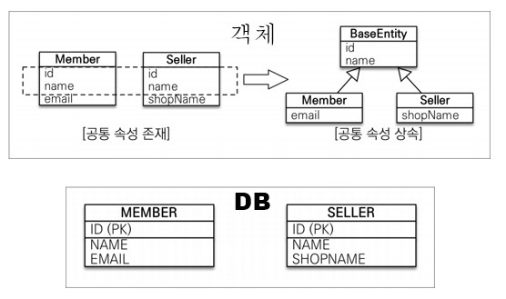
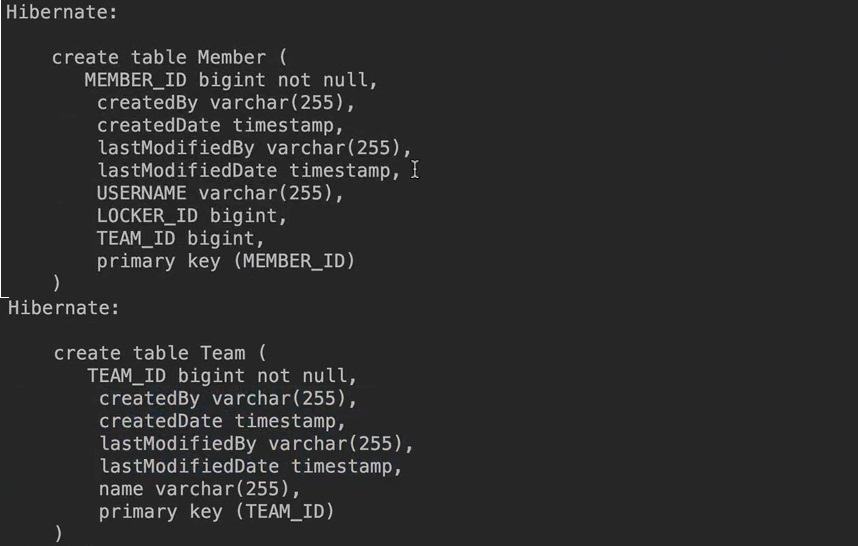

# 고급 맵핑

## 상속 관계 맵핑


- 객체는 상속관계가 있지만 관계형 데이터베이스는 상속 관계가 없다.
- 그나마 슈퍼타입 서브타입 관계라는 모델링 기법이 객체 상속과 유사하다.
- 상속관계 맵핑이라는 것은 객체의 상속 구조와 DB의 슈퍼타입 서브타입 관계를 맵핑하는 것이다.
- 슈퍼타입 서브타입 논리 모델을 실제 물리 모델로 구현하는 방법에는 3가지가 있다.
	* 각각 테이블로 변환 -> 조인 전략
	* 통합 테이블로 변환 -> 단일 테이블 전략
	* 서브타입 테이블로 변환 -> 구현 클래스마다 테이블 전략

### 조인 전략


- ITEM, ALBUM, MOVIE, BOOK 테이블을 만들고 필요할 경우 JOIN으로 데이터를 구성한다.
- NAME, PRICE가 ITEM 테이블에만 저장되고, ALBUM, MOVIE, BOOK이 각자의 데이터만 저장한다.
	* INSERT 할때는 2번 INSERT한다.
	* 조회할 때는 PK, FK로 JOIN해서 데이터를 가져온다.
- 가장 정규화 된 방법으로 구현하는 방식이다.
- 보통 구분하는 컬럼(DTYPE)를 둔다.
- 사용 방법 : 부모클래스에서 `@Inheritance(strategy = InheritanceType.JOINED)`로 설정한다.

```java
@Entity
@Inheritance(strategy = InheritanceType.JOINED)
@DiscriminatorColumn // 하위 테이블의 구분 컬럼 생성(default = DTYPE) 
public class Item {

    @Id @GeneratedValue
    private Long id;

    private String name;
    private int price;
}
```

```java
@Entity
public class Album extends Item {
    private String artist;
}
```

```java
@Entity
public class Movie extends Item {
    private String director;
    private String actor;

    // ...getter and setter...
}
```

```java
@Entity
public class Book extends Item {
    private String author;
    private String isbm;
}
```

- Movie 객체 저장
	* ITEM 테이블에 id, name, price 생성, MOVIE 테이블에 actor, director, id 생성
	* INSERT 쿼리가 2번 나간다.
	* DTYPE에 Entity 이름이 기본값으로 저장된다.

```java
Movie movie = new Movie();
movie.setDirector("aaaa");
movie.setActor("bbbb");
movie.setName("바람과함께사라지다.");
movie.setPrice(10000);

em.persist(movie);

tx.commit();
```

- Movie 객체 조회
	* ITEM 테이블과 MOVIE 테이블을 JOIN해서 데이터를 가져온다.

```java
Movie movie = new Movie();
movie.setDirector("aaaa");
movie.setActor("bbbb");
movie.setName("바람과함께사라지다.");
movie.setPrice(10000);

em.persist(movie);

em.flush();
em.clear();

Movie findMove = em.find(Movie.class, movie.getId());
System.out.println("findMove = " + findMove);

tx.commit();
```

### 단일 테이블 전략


- 논리 모델을 한 테이블로 합치는 것이다.
- ALBUM, MOVIE, BOOK을 구분할 DTYPE 컬럼으로 어떤 것인지 구분한다.
	* 반드시 구분하는 컬럼이 있어야 한다.
	* `@DiscriminatorColumn`을 선언해 주지 않아도, 기본으로 DTYPE 컬럼이 생성된다.
	* 한 테이블에 모든 컬럼을 저장하기 때문에, DTYPE 없이는 테이블을 판단할 수 없다.
- INSERT 쿼리가 1번만 나가고, JOIN할 필요도 없기 때문에 성능이 좋다.
- 단일 테이블 적용
	* strategy를 SINGLE_TABLE로 변경하기만 하면 된다.
		- JPA의 장점이다. 테이블 구조의 변동이 일어났는데, 코드를 거의 손대지 않고 어노테이션만 수정하면 된다.
	* `@Inheritance(strategy = InheritanceType.SINGLE_TABLE)`

```java
@Entity
@DiscriminatorColumn
@Inheritance(strategy = InheritanceType.SINGLE_TABLE)
public class Item {

    @Id @GeneratedValue
    private Long id;

    private String name;
    private int price;
}
```

### 구현 클래스마다 테이블 전략


- ALBUM, MOVIE, BOOK 테이블을 만들어 컬럼들을 각 테이블마다 모두 가지는 방법이다.
	* NAME, PRICE 컬럼들이 중복되도록 허용한다.
- 구현 클래스마다 테이블 생성 전략 적
	* strategy를 TABLE_PER_CLASS로 변경한다.
	* `@Inheritance(strategy = InheritanceType.TABLE_PER_CLASS)`

```java
@Entity
@Inheritance(strategy = InheritanceType.TABLE_PER_CLASS)
public abstract class Item { //  ITEM 엔티티는 실제 생성되는 테이블이 아니므로 abstract 클래스여야 하고, @DiscriminatorColumn도 필요가 없어진다.

    @Id @GeneratedValue
    private Long id;

    private String name;
    private int price;
}
```

- 구현 클래스마다 테이블 생성 전략 문제점
	* INSERT는 간단하지만 조회는 굉장히 비효율적으로 동작한다.
	* union all로 전체 하위 테이블을 다 찾는다.

### 상속 관계 맵핑 전략 정리

- 조인 전략
	* 장점
		- 테이블이 정규화가 되어있다.(따라서 조인 전략이 가장 권장된다.)
		- 외래키 참조 무결성 제약조건을 활용 가능하다.
			* ITEM의 PK가 ALBUM, MOVIE, BOOK의 PK이자 FK이므로 다른 테이블에서 ITEM 테이블만 바라보도록 설계하는 것이 가능하다. 이렇게 하면 설계가 깔끔하다.
		- 저장 공간이 효율화된다.
	* 단점
		- 조회시 조인을 많이 사용한다. (성능 저하)
		- 조회 쿼리가 복잡하다.
		- 데이터를 저장할 때 INSERT 쿼리가 2번 나간다.(이건 큰 단점은 아니다)
- 단일 테이블 전략
	* 장점
		- JOIN이 필요 없으므로 일반적인 조회 성능이 빠르다.
		- 조회 쿼리가 단순하다.
	* 단점
		- 자식 엔티티가 맵핑한 컬럼은 모두 NULL을 허용해야 한다.
		- 단일 테이블에 모든 것을 저장하므로 테이블이 커질 수 있다.
		- 상황에 따라서 조인 전략보다 성능이 오히려 느려질 수 있다.
- 구현 클래스마다 테이블 전략
	* 결론적으로 이 전략은 쓰지 않는게 좋다.
		- ORM을 하다보면 DB쪽과 객체지향 개발쪽에서 trade off를 할 때가 있는데, 이 전략은 둘 다 추천하지 않는다.
	* 장점
		- 서브 타입을 명확하게 구분해서 처리할 때 효과적이다.
		- NOT NULL 제약조건을 사용할 수 있다.
	* 단점
		- 여러 자식 테이블을 함께 조회할 때 성능이 느리다.(UNION SQL)
		- 자식 테이블을 통합해서 쿼리하기 어렵다.
		- 변경이라는 관점으로 접근할 때 굉장히 좋지 않다.
- 결론
	* 기본적으로는 조인 전략을 가져가는게 좋다.
	* 조인 전략과 단일 테이블 전략의 장단점을 고민해서 알맞은 전략을 선택하는 것이 좋다.
	* 구현 클래스마다 테이블 전략은 쓰지 않는게 좋다.
	* 굉장히 심플하고 확장의 가능성도 적으면 단일 테이블 전략을 사용하고 비즈니스 적으로 중요하고, 복잡하고, 확장될 확률이 높으면 조인 전략을 사용하는 것이 권장된다.

## @MappedSuperclass


- 객체 입장에서 공통 맵핑 정보가 필요할 때 사용한다.(id, name)
- 공통 속성을 부모 클래스에 선언하고 속성만 상속 받아서 사용하고 싶을 경우 `@MappedSuperclass`를 사용한다.

### 코드로 이해하기

- 생성자, 생성시간, 수정자, 수정시간을 모든 엔티티에 공통으로 가져가야 하는 상황이라고 가정하면
	
```java
@MappedSuperclass // 맵핑정보만 상속받는 Superclass라는 의미의 @MappedSuperclass 어노테이션 선언해야 한다.
public abstract class BaseEntity {

    // @Column 애노테이션의 name 속성으로 이름을 변경해도 상속받는 엔티티에 모두 적용된다. 
    private String createdBy;

    private LocalDateTime createdDate;

    private String lastModifiedBy;

    private LocalDateTime lastModifiedDate;

    // ...getter and setter...
}
```

- 엔티티에 BaseEntity를 상속받도록 코드 수정

```java
@Entity
public class Member extends BaseEntity {
    
    // ...
}
```

```java
@Entity
public class Team extends BaseEntity {
    
    // ...
}
```

- 이렇게 하면 엔티티에 BaseEntity에 선언된 컬럼들이 생성 된다.


### @MappedSuperclass 정리

- 상속광계 맵핑이 아니다.
- `@MappedSuperclass`가 선언되어 있는 클래스는 엔티티가 아니므로 테이블과 맵핑도 안된다.
- 부모 클래스를 상속 받는 자식 클래스에 맵핑 정보만 제공한다.
- 조회, 검색이 불가능하다. 부모 타입으로 조회하는 것이 불가능하다는 이야기.
	* `em.find(BaseEntity` 불가능
- 직접 생성해서 사용할 일이 없으므로 추상 클래스로 만드는 것을 권장된다.
- 테이블과 관계가 없고, 단순히 엔티티가 공통으로 사용하는 맵핑 정보를 모으는 역할을 한다.
- 주로 등록일, 수정일, 등록자, 수정자 같은 전체 엔티티에서 공통으로 적용하는 정보를 모을 때 사용한다.
- JPA에서 @Entity클래스는 `@Entity`나 `@MappedSuperclass`로 지정한 클래스만 상속할 수 있다.

## 복합키와 식별 관계 매핑

### 식별 관계 vs 비식별 관계

- 식별 관계(Identifying Relationship)
	* 부모 테이블의 기본키를 내려받아서 자식 테이블의 기본키 + 외래키로 사용하는 관계
- 비식별 관계(Non-Identifying Relationship)
	* 부모 테이블의 기본키를 받아서 자식 테이블의 외래키로만 사용하는 관계
	* 필수적 비식별 관계(Mandatory)
		- 외래키에 NULL을 허용하지 않는다.
		- 연관관계를 필수적으로 맺어야 한다.
	* 선택적 비식별 관계(Optional)
		- 외래키에 NULL을 허용한다.
		- 연관관계를 맺을지 말지 선택할 수 있다.
- 최근에는 db설계 시 비식별 관계를 주로 사용하고 꼭 필요한 곳에만 식별 관계를 사용하는 추세
- JPA는 식별 관계와 비식별 관계를 모두 지원한다.

### 복합키 : 비식별 관계 매핑

- 둘 이상의 컬럼으로 구성된 복합 기본키는 별도의 식별자 클래스를 만들어야 한다.
- JPA는 영속성 컨텍스트에 엔티티를 보관할 때 엔티티의 식별자를 키로 사용한다.
	* 식별자를 구분하기 위해 `equals()`와 `hashCode()`를 사용해서 동등성 비교를 한다.
- 따라서 식별자 필드가 2개 이상이면 별도의 식별자 클래스를 만들고 그곳에 `equals()`와 `hashCode()`를 구현해야 한다.
- JPA에서는 복합키를 지원하기 위해 2가지 방법을 제공한다.
	* `@IdClass` : 관계형 데이터베이스에 가까운 방법
	* `@EmbeddedId` : 좀 더 객체지향에 가까운 방법

#### @IdClass

- 복합키를 매핑하기 위해 식별자 클래스를 별도로 생성
- 식별자 클래스의 속성명과 엔티티에서 사용하는 식별자의 속성명이 같아야 한다.
- Serializable 인터페이스를 구현해야 한다.
- `equals()`, `hashCode()`를 구현해야 한다.
- 기본 생성자가 있어야 한다.
- 식별자 클래스는 public이어야 한다.

```java
public class ParentId implements Serializable {

    private String id1;
    priavte String id2;

    ... // 기본 생성자, equals(), hashCode() 등 구현 필요
}
```

```java
@Entity
@IdClass(ParentId.class)
public class Parent {

    @Id
    @Column(name = "PARENT_ID1")
    private String id1; // ParentId.id1과 연결

    @Id
    @Column(name = "PARENT_ID2")
    private String id2; // ParentId.id2과 연결

    ...
}
```

- 부모 테이블의 기본키 컬럼이 복합키면 자식 테이블의 외래키도 복합키다.
	* 따라서 외래키 매핑 시 여러 컬럼을 매핑해야하므로 `@JoinColumns`로 각각의 외래키 컬럼을 매핑한다.
	* 참고로 아래 코드와 같이 `@JoinColumn`의 name 속성과 referencedColumnName 속성의 값이 같으면 referencedColumnName은 생략 가능하다.

```java
@Entity
public class Child {

    @Id
    private String id;

    @ManyToOne
    @JoinColumns ({
        @JoinColumn(name = "PARENT_ID1", referenceColumnName = "PARENT_ID1"),
        @JoinColumn(name = "PARENT_ID2", referenceColumnName = "PARENT_ID2"),
    })
    private Parent parent;

}
```

#### @EmbeddedId

- `@IdClass`는 데이터베이스에 맞춘 방법이고 `@EmbeddedId`는 좀 더 객체지향적인 방법이다.
- Parent 엔티티에서 식별자 클래스를 직접 사용하고 `@EmbeddedId` 어노테이션을 적어주면 된다.
- `@IdClass`와는 다르게 `@EmbeddedId`를 적용한 식별자 클래스는 식별자 클래스에 기본키를 직접 매핑한다.
- Serializable 인터페이스를 구현해야 한다.
- `equals()`, `hashCode()`를 구현해야 한다.
- 기본 생성자가 있어야 한다.
- 식별자 클래스는 public이어야 한다.

```java
@Embeddable
public class ParendId implements Serializable {

    @Column(name = "PARENT_ID1")
    private String id1;

    @Column(name = "PARENT_ID2")
    private String id2;

    ...
}
```

#### @IdClass vs @EmbeddedId

- 각각 장단점이 있으므로 취향에 맞게, 일관성 있게 사용하면 된다.
- `@EmbeddedId`가 좀 더 객체지향적이고 중복도 없어서 좋아보이지만 특정 상황에 따라 JPQL이 조금 더 길어질 수 있다.

### 식별 vs 비식별

- 데이터베이스 설계 관점에서 다음과 같은 이유로 식별 관계보다는 비식별 관계를 선호한다.
	* 식별 관계는 부모 테이블의 기본키를 자식 테이블로 전파하면서 자식 테이블의 기본키 컬럼이 점점 늘어난다.
		- 따라서 조인할 때 SQL이 복잡해지고 기본키 인덱스가 불필요하게 커질 수 있다.
	* 식별 관계는 2개 이상의 컬럼을 합해서 복합 기본키를 만들어야 하는 경우가 많다.
	* 식별 관계를 사용할 때 기본키로 비즈니스 의미가 있는 자연키 컬럼을 조합하는 경우가 많다.
		- 비식별 관계의 기본키는 비즈니스와 전혀 관계없는 대리키를 주로 사용한다.
	* 식별 관계는 부모 테이블의 기본키를 자식 테이블의 기본키로 사용하므로 비식별 관계보다 테이블 구조가 유연하지 못하다.
- 객체 관계 매핑의 관점에서 다음과 같은 이유로 비식별 관계를 선호한다.
	* 일대일 관계를 제외하고 식별 관계는 2개 이상의 컬럼을 묶은 복합 기본키를 사용한다.
		- JPA에서 복합키는 별도의 복합키 클래스를 만들어서 사용해야 한다.
		- 따라서 컬럼이 하나인 키본키를 매핑하는 것보다 많은 노력이 필요하다.
	* 비식별 관계의 기본키는 주로 대리키를 사용하는데 JPA는 `@GenerateValue`처럼 대리키를 생성하기 위한 편리한 방법을 제공한다.

### Links

[자바 ORM 표준 JPA 프로그래밍 - 기본편](https://www.inflearn.com/course/ORM-JPA-Basic/dashboard)
