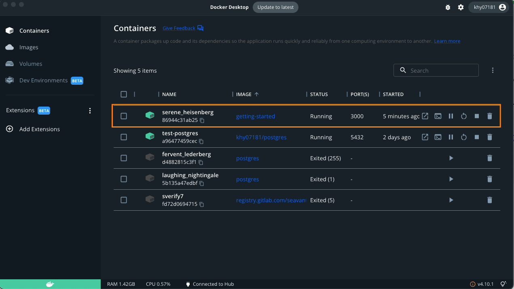

# Docker

- 컨테이너 기반의 오픈소스 가상화 플랫폼
- 다른 모든 프로세스와 격리된 시스템의 샌드박스 프로세서
- 다양한 프로그램, 실행 환경을 컨테이너로 추상화하고 동일한 인터페이스를 제공하여 프로그램의 배포 및 관리를 단순하게 해준다.
- 백엔드 프로그램, DB 서버, 메시지 큐 등 어떤 프로그램도 컨테이너로 추상화 할 수 있다.

## Container

- 어플리케이션이 하나의 환경에서 다른 환경으로 빠르고 안정적이게 실행될 수 있도록 코드와 모든 종속성을 패키징하는 소프트웨어의 표준 단위이다.
- 컨테이너는 격리된 프로세스가 동작하는 기술이다.
- VM 비해 매우 빠르다.

## Image

- 컨테이너 실행에 필요한 파일과 설정값 등을 포함하고 있는 것
- 상태값을 가지지 않고 변하지 않는다.
	- immutable
- 컨테이너는 이미지를 실행한 상태이며 추가되거나 변하는 값은 컨테이너에 저장된다.
- 같은 이미지에서 여거 개의 컨테이너를 생성할 수 있고 컨테이너의 상태가 바뀌거나 컨테이너가 삭제되더라도 이미지는 변하지 않고 그대로 남아있다.
- 도커 이미지는 [Docker hub](https://hub.docker.com/)에 등록하거나 [Docker registry](https://docs.docker.com/registry/) 저장소를 직접 만들어 관리할 수 있다.

---

## Containerize an application

### Build the app’s container image

clone example code
- `git clone https://github.com/docker/getting-started.git`

Dockerfile 생성

```shell
# syntax=docker/dockerfile:1
FROM node:12-alpine
RUN apk add --no-cache python2 g++ make
WORKDIR /app
COPY . .
RUN yarn install --production
CMD ["node", "src/index.js"]
EXPOSE 3000
```

컨테이너 이미지 빌드
- `docker build -t getting-started .`

### Start an app container

docker 이름 지정 및 run
- `docker run -dp 3000:3000 getting-started`

http://localhost:3000/ 에 접속하면 다음과 같은 화면이 정상적으로 나온다.


Docker Desktop의 Dashboard에도 `getting-started` 이미지를 사용하고 3000 포트에서 실행 중인 컨테이너가 표시된다.


## Update the application

### Update the source code

- 예제 코드 기준 line 56 수정

```
 - <p className="text-center">No items yet! Add one above!</p>
 + <p className="text-center">You have no todo items yet! Add one above!</p>
 ...
```

image의 업데이트 된 버전 build
- `docker build -t getting-started .`

새로운 컨테이너 시작
- `docker run -dp 3000:3000 getting-started`

그러면 포트가 사용중이라는 오류가 난다.
- `port is already allocated`
- 이전 컨테이너가 실행되는 동안 새로운 컨테이너를 시작할 수 없다.
	- 이전 컨테이너가 호스트의 3000 포트를 사용하고 있기 때문

### Remove the old container

컨테이너 확인
- `docker ps`

컨테이너 중지
- `docker stop <the-container-id>`

컨테이너 삭제
- `docker rm <the-container-id>`

### Start the updated app container

새로운 컨테이너 실행
`docker run -dp 3000:3000 getting-started`

http://localhost:3000/ 에 접속하면 다음과 같은 수정된 화면이 정상적으로 나온다.


## Share the application

### 저장소 생성

1. [Docker Hub](https://hub.docker.com/)
2. 저장소 생성
3. repository 이름은 `getting-started`로 설정한다.

### image push

### 새 인스턴스에서 image 실행
