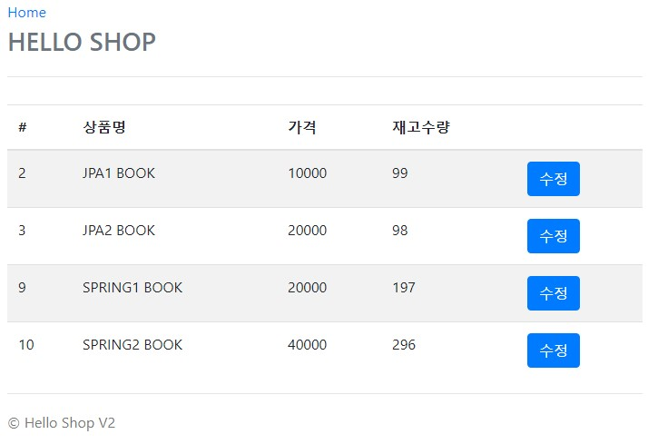
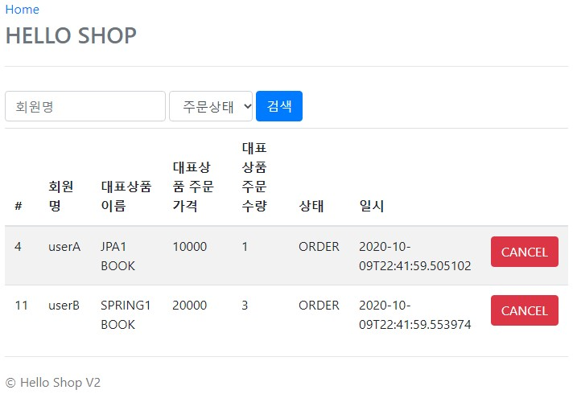

# API 개발 고급 준비

## API 개발 고급 소개

- 조회에 대한 성능 최적화 내용이다.
- 사실 등록이나 수정은 성능 문제가 거의 발생하지 않는다.
- 시스템 장애의 90%는 조회에서 나온다.
    * 사람들은 조회를 많이 한다.

## 조회용 샘플 데이터 입력

- application.yml에 jpa.ddl-auto를 create로 설정하고 데이터를 입력한다.

```java
@Component
@RequiredArgsConstructor
public class InitDb {
    private final InitService initService;
    @PostConstruct
    public void init() {
        initService.dbInit1();
        initService.dbInit2();
    }
    @Component
    @Transactional
    @RequiredArgsConstructor
    static class InitService {
        private final EntityManager em;
        public void dbInit1() {
            Member member = createMember("userA", "서울", "1", "1111");
            em.persist(member);
            Book book1 = createBook("JPA1 BOOK", 10000, 100);
            em.persist(book1);
            Book book2 = createBook("JPA2 BOOK", 20000, 100);
            em.persist(book2);
            OrderItem orderItem1 = OrderItem.createOrderItem(book1, 10000, 1);
            OrderItem orderItem2 = OrderItem.createOrderItem(book2, 10000, 2);
            Order order = Order.createOrder(member, createDelivery(member), orderItem1, orderItem2);
            em.persist(order);
        }
        public void dbInit2() {
            Member member = createMember("userB", "부산", "2", "2222");
            em.persist(member);
            Book book1 = createBook("SPRING1 BOOK", 20000, 200);
            em.persist(book1);
            Book book2 = createBook("SPRING2 BOOK", 40000, 300);
            em.persist(book2);
            Delivery delivery = createDelivery(member);
            OrderItem orderItem1 = OrderItem.createOrderItem(book1, 20000, 3);
            OrderItem orderItem2 = OrderItem.createOrderItem(book2, 40000, 4);
            Order order = Order.createOrder(member, delivery, orderItem1, orderItem2);
            em.persist(order);
        }
        private Member createMember(String name, String city, String street, String zipcode) {
            Member member = new Member();
            member.setName(name);
            member.setAddress(new Address(city, street, zipcode));
            return member;
        }
        private Delivery createDelivery(Member member) {
            Delivery delivery = new Delivery();
            delivery.setAddress(member.getAddress());
            return delivery;
        }
        private Book createBook(String name, int price, int stockQuantity) {
            Book book = new Book();
            book.setName(name);
            book.setPrice(price);
            book.setStockQuantity(stockQuantity);
            return book;
        }
    }
}
```

- 다음과 같이 데이터가 잘 들어간 것을 확인할 수 있다.




### Links

[실전! 스프링 부트와 JPA 활용2 - API 개발과 성능 최적화](https://www.inflearn.com/course/%EC%8A%A4%ED%94%84%EB%A7%81%EB%B6%80%ED%8A%B8-JPA-API%EA%B0%9C%EB%B0%9C-%EC%84%B1%EB%8A%A5%EC%B5%9C%EC%A0%81%ED%99%94/dashboard)
