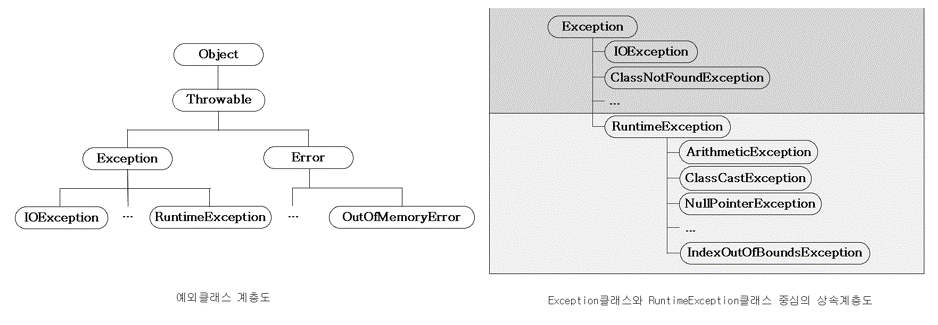
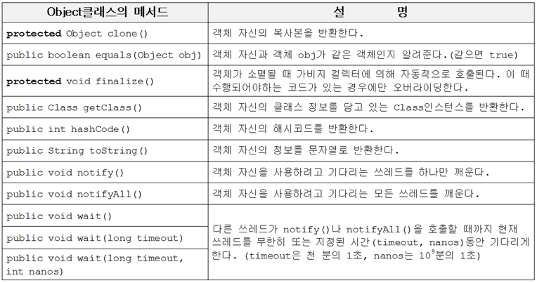
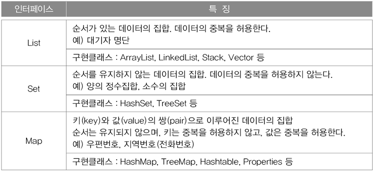
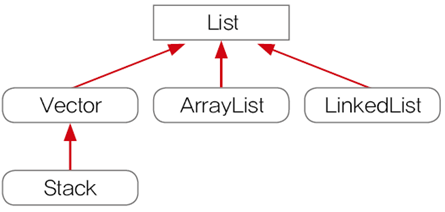
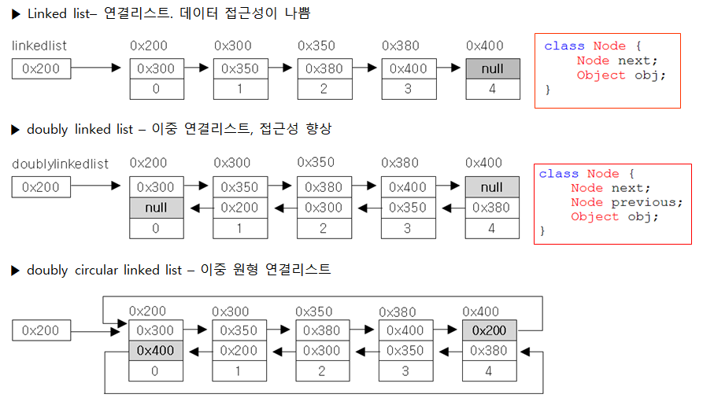
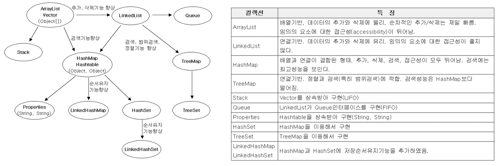

## 6. 객체지향 프로그래밍

### 클래스와 객체

```java
class 클래스명 {
	...
}
```

- 클래스로부터 객체를 만드는 과정을 클래스의 인스턴스화라고 하며, 어떤 클래스로부터 만들어진 객체를 그 클래스의 인스턴스라고 한다.
- 인스턴스는 참조 변수를 통해서만 다룰 수 있으며, 참조 변수의 타입은 인스턴스의 타입과 일치해야 한다.
- 클래스는 데이터와 함수의 결합으로서 구조체 개념에서 Method 개념을 더한 것이다.

### 변수의 종류

| 변수의 종류   | 선언위치                                                  | 생성시기                    |
| ------------- | --------------------------------------------------------- | --------------------------- |
| 클래스 변수   | 클래스 영역                                               | 클래스가 메모리에 올라갈 때 |
| 인스턴스 변수 | 클래스 영역                                               | 인스턴스가 생성되었을 때    |
| 지역변수      | 클래스 영역 이외의 영역(메서드, 생성자, 초기화 블록 내부) | 변수 선언문이 수행되었을 때                            |

- 인스턴스 변수는 인스턴스가 생성될 때마다 생성되므로 각기 다른 값을 유지할 수 있지만, 클래스 변수는 모든 인스턴스가 하나의 저장공간을 공유하므로, 항상 공통된 값을 갖는다.

```java
class Card {
	// 인스턴스 변수
	String kind;
	int number;
	// 클래스 변수
	static int width = 100;
	static int height = 250;
}
```

### 클래스 메서드와 인스턴스 메소드

- 클래스 메서드는 인스턴스 변수나 인스턴스 메서드를 사용하지 않는 메서드이다.
- 인스턴스 메서드는 인스턴스 변수와 관련된 작업을 하는, 즉 메서드의 작업을 수행하는데 인스턴스를 변수를 필요로 하는 메서드이다.

### 오버 로딩

- 오버 로딩이란 한 클래스 내에 같은 이름의 메서드를 여러 개 정의하는 것을 메서드 오버로딩이라고 한다.
- 메소드 이름이 같아야 한다.
- 매개변수의 개수 또는 타입이 달라야 한다.
- 변환 타입은 오버 로딩을 구현하는데 아무런 영향을 주지 못한다.

### 생성자

- 생성자 이름은 클래스의 이름과 같아야 한다.
- 생성자는 리턴 값이 없다.
- 클래스에는 반드시 하나 이상의 생성자가 존재해야 한다.

### this

- 생성자의 이름으로 클래스 이름 대신 this를 사용한다.
- 한 생성자에서 다른 생성자를 호출할 때는 반드시 첫 줄에서만 호출이 가능하다.
- this : 인스턴스 자신을 가리키는 참조 변수, 인스턴스의 주소가 저장되어 있다.
- this( ) : 생성자, 같은 클래스의 다른 생성자를 호출할 때 사용한다.

```java
class Car3 {
	String color;
	String geartype;
	int door;

	Car3() {
		this("white", "auto", 4);
	}

	Car3(Car3 c) {
		this(c.color, c.geartype, c.door);
	}

	Car3(String color, String geartype, int door) {
		this.color = color;
		this.geartype = geartype;
		this.door = door;
	}
}
```

### 변수의 초기화

- 멤버 변수 (클래스 변수와 인스턴스 변수)와 배열의 초기화는 선택적이지만, 지역변수의 초기화는 필수적이다.
- 클래스 변수의 초기화 순서 : 기본값 - 명시적 초기화 - 클래스 초기화 블록
- 인스턴스 변수의 초기화 순서 : 기본값 - 명시적 초기화 - 인스턴스 초기화 블록 - 생성자

#### 멤버 변수의 초기화 방법

- 명시적 초기화
- 생성자
- 초기화 블록

## 7. 객체지향 프로그래밍 2

### Overriding

- 상위 클래스로부터 상속받은 메서드의 내용을 변경하는 것을 오버라이딩이라고 한다.
- 상위 클래스와 이름, 매개변수, 반환타입이 같아야 한다.
- 접근 제어자는 조상 클래스의 메서드보다 좁은 범위로 변경할 수 없다.
- 상위 클래스의 메서드보다 많은 수의 예외를 선언할 수 없다.
- 인스턴스 메서드를 static 메서드로 또는 그 반대로 변경할 수 없다.

### super

- 하위 클래스에서 상위 클래스로부터 상속받은 멤버를 참조하는 데 사용되는 참조 변수이다.
- 상위 클래스의 멤버와 자신의 멤버를 구별하는데 사용된다는 점을 제외하고는 this와 같다.

### 접근 제어자

- private - 같은 클래스 내에서만 접근이 가능하다.
- default - 같은 패키지 내에서만 접근이 가능하다.
- protected - 같은 패키지 내에서, 그리고 다른 패키지의 자손 클래스에서 접근이 가능하다.
- public - 접근 제한이 없다

| 제어자    | 같은 클래스 | 같은 패키지 | 자손 클래스 | 전체 |
| --------- |:-----------:|:-----------:|:-----------:|:----:|
| public    |      O      |      O      |     O      |  O  |
| protected |      O      |      O      |     O      |      |
| (default) |      O      |      O      |             |      |
| private   |      O      |             |             |      |

### 다형성

- 상위클래스 타입의 참조 변수로 하위 클래스의 인스턴스를 참조할 수 있도록 하는 것.
	* 반대로는 불가능
- 하위 클래스의 인스턴스를 상위 클래스의 참조 변수로 참조해도 하위 클래스에만 있는 멤버 변수는 사용할 수 없다.
- 참조변수의 형 변환
	* 자손 타입 --> 조상 타입 (Up-casting) : 형 변환 생략 가능
	* 자손 타입 <-- 조상 타입 (Down-casting) : 형 변환 생략 불가
	* 서로 상속 관계에 있는 타입 간의 형 변환은 양방향으로 자유롭게 수행될 수 있으나, 참조변수가 가리키는 인스턴스의 자손타입으로 형변환은 허용되지 않는다.
- 멤버변수가 중복 정의된 경우, 참조변수의 타입에 따라 연결되는 멤버변수가 달라진다.
	- (참조변수타입에 영향받음)
- 메서드가 중복정의된 경우, 참조변수의 타입에 관계없이 항상 실제 인스턴스의 타입에 정의된 메서드가 호출된다.
	- (참조변수타입에 영향받지 않음)

```java
class parent {
	int x = 100;

	void method() {
		System.out.println("Parent Method");
	}
}

class Child extends Parent {
	int x = 200;

	void method() {
		System.out.println("Child Method");
	}
}

public static void main(String[] args) {
	Parent p = new Child();
	Child c = new Child();

	System.out.println("p.x = " + p.x);
	p.method();

	System.out.println("c.x = " + c.x);
	c.method();
}
/*
	p.x = 100
	Child Method
	c.x = 200
	Child Method
*/
```

### 추상 클래스

```java
abstract class 클래스이름 {
	...
}
```

- 클래스가 설계도라면 추상 클래스는 미완성 설계도이다.
- 추상 메서드를 포함하고 있는 클래스이다.
- 인스턴스를 생성할 수 없다.
- 다른 클래스를 작성하는 데 도움을 줄 목적으로 작성된다.
- 일반 메서드가 추상 메서드를 호출할 수 있다.

#### 추상 메서드

- 꼭 필요하지만 자손마다 다르게 구현될 것으로 예상되는 경우에 사용한다.
- 추상 클래스를 상속받는 자손 클래스에서 추상 메서드의 구현부를 완성해야 한다.
- 굳이 abstract를 붙여서 추상 클래스와 추상 메서드를 만드는 이유는 하위 클래스에서 추상메서드를 반드시 구현하도록 강요하기 위해서이다.

### 인터페이스

```java
interface 인터페이스이름 {
	public static final 타입 상수이름 = 값;
    public abstract 메서드이름 (매개변수 목록);
}
```

- 일종의 추상 클래스이다.
- 추상 클래스가 미완성 설계도라면 인터페이스는 더 추상적인 기본 설계도이다.
- 모든 멤버 변수는 public static final 이어야 하며, 생략 가능하다.
- 모든 메서드는 public abstract 이어야 하며, 생략 가능하다.
- 인터페이스로부터만 상속받을 수 있으며, 클래스와는 달리 다중 상속이 가능하다.

#### 인터페이스의 구현

```java
class 클래스이름 implements 인터페이스이름 {
	// 인터페이스에 정의된 추상메서드를 구현해야 한다.
}
```

- 인터페이스에서 정의된 추상 메서드를 구현할 때 추상 메서드의 제어자가 생략되어되어있으면 인터페이스를 구현할 때 접근 제어자를 public으로 설정해야 한다.
- 인터페이스 타입의 참조 변수로 이를 구현한 클래스의 인스턴스를 참조할 수 있으며, 인터페이스 타입으로의 형 변환도 가능하다.
- 인터페이스는 메서드의 매개변수 타입으로 사용될 수 있는데 이는 해당 인터페이스를 구현한 클래스의 인스턴스를 매개변수로 제공해야 한다는 의미이다.
- return type이 인터페이스라는 것은 메서드가 해당 인터페이스를 구현한 클래스의 인스턴스를 반환한다는 것을 의미한다.

## 8. 예외처리(Exception Handling)

### 에러의 구분

- 컴파일 에러 : 컴파일 시에 발생하는 에러
- 런타임 에러 : 실행 시에 발생하는 에러
- 논리적 에러 : 실행은 되지만, 의도와 다르게 동작하는 것

#### 자바에서의 에러

- 런타임 에러를 에러(error)와 예외(exception)로 구분
- 에러(error) : 프로그램 코드에 의해서 수습될 수 없는 심각한 오류
- 예외(exception) : 프로그램 코드에 의해서 수습될 수 있는 다소 미약한 오류

- Exception 클래스들(checked exception) : 사용자의 실수와 같은 외적인 요인에 의해 발생하는 예외 (예외처리 필수)
- RuntimeException 클래스들(unchecked exception) : 프로그래머의 실수로 발생하는 예외 (예외처리 선택)

### 예외처리 하기 : try-catch

- 예외처리의 정의 : 프로그램 실행 시 발생할 수 있는 예외의 발생에 대비한 코드를 작성하는 것
- 예외처리의 목적 : 프로그램의 비정상 종료를 막고, 정상적인 실행상태를 유지하는 것

```java
try {
	// 예외가 발생할 가능성이 있는 문장들을 넣는다.
} catch (Exception1 e1) {
	// Exception1이 발생했을 경우, 이를 처리하기 위한 문장을 적는다.
} catch (Exception2 e2) {
	// Exception2이 발생했을 경우, 이를 처리하기 위한 문장을 적는다.
} catch (ExceptionN eN) {
	// ExceptionN이 발생했을 경우, 이를 처리하기 위한 문장을 적는다.
}
// if문과들 달리 문장이 하나여도 { } 생략이 불가능
```

- try-catch문 내에 try-catch문을 쓸 수 있지만 변수가 중복되서는 안 된다.
- try블록 내에서 예외가 발생한 경우
	- 발생한 예외와 일치하는 catch블록을 확인 --> 일치하는 catch블록을 찾으면 문장들을 수행하고 전체 try-catch문을 빠져나가 다음 문장을 수행한다.
	- 일치하는 catch블록을 찾지 못하면, 예외는 처리되지 못한다.
- try블록 내에서 예외가 발생하지 않은 경우
	- catch블록을 거치지 않고 전체 try-catch문을 빠져나가서 수행을 계속한다.
- catch블록의 ( ) 안에 Exception클래스 타입의 참조 변수를 선언해 놓으면 어떤 종류의 예외가 발생하더라도 이 catch블록에 의해서 처리된다.
	- 따라서 항상 마지막 catch문에 사용해야 한다. 그렇지 않으면 밑의 블록까지 내려가기 전에 다 예외처리를 해버린다. 예외 클래스의 인스턴스에 담겨있는 정보를 얻을 수 있는 방법
- `printStackTrace()`
	- 예외 발생 당시의 호출 스택에 있었던 메서드의 정보와 예외 메시지를 화면에 출력한다.
- `getMessage( )`
	- 발생한 예외 클래스의 인스턴스에 저장된 메시지를 얻을 수 있다.

##### finally 블록

```java
try {
	// 예외가 발생할 가능성이 있는 문장들을 넣는다.
} catch (Exception1 e1) {
	// 예외처리를 위한 문장을 적는다.
} finally {
	// 예외 발생여부에 관계없이 항상 수행되어야하는 문장들을 넣는다.
    // finally블럭은 try-catch문의 맨 마지막에 위치해야한다.
}
```

- 예를 들어 예외가 없어 try문만 실행되어도, 예외가 있어 try문이 끝까지 수행하지 못하고 catch문으로 실행되어도 실행되어야 하는 문장들을 finally에 넣어 반드시 실행시킬 수 있게 하고 코드의 중복을 줄인다.
- catch문에서 예외처리를 하고 return 하여 반환해도 finally문은 실행된다.

### 예외 발생시키기

- 발생시키려는 예외 클래스의 객체를 만든 다음 throw를 이용해서 예외를 발생시킨다.

```java
public class ExceptionEx9 {

	public static void main(String[] args) {
		try {
			throw new Exception("고의로 발생시켰음");
		} catch (Exception e) {
			System.out.println("에러 메시지 : " + e.getMessage());
			e.printStackTrace();
		}
		System.out.println("프로그램 정상종료");
	}
}
```

### 메서드에 예외 선언하기

```java
void method() throws Exception1, Exception2, ... ExceptionN {
	// 메서드의 내용
}
// 예외를 발생시킬때는 throw, 예외를 메서드에 선언할 때는 throws
```

#### 예외 되던지기

- 한 메서드에서 발생할 수 있는 예외가 여럿인 경우, 몇 개는 try-catch문을 통해서 메서드 내에서 자체적으로 처리하고, 나머지는 선언부에 지정하여 호출한 메서드에서 처리하도록 함으로써, 양쪽에서 나눠서 처리되도록 할 수 있다.
- 하나의 예외에 대해서 예외가 발생한 메서드와 이를 호출한 메서드 양쪽 모두 처리해줘야 할 작업이 있을 때도 활용 가능하다.

```java
public class Exception {

	public static void main(String[] args) {
		try {
			method1();
		} catch (Exception e) {
			System.out.println("main 메서드에 의해 예외 처리");
		}
	}

	static void method1() throws Exception {
		try {
			throw new Exception();
		} catch (Exception e) {
			System.out.println("method1 메서드에 의해 예외 처리");
			throw e;
		}
	}
}
```

## 9. java.lang 패키지와 유용한 클래스

### Object 클래스



#### equals(Object obj)

```java
public boolean equals(Object obj) {
	return (this==obj);
}
```

- 매개변수로 객체의 참조 변수를 받아서 비교하여 그 결과를 boolean값으로 알려주는 역할을 한다.
- 두 참조 변수에 저장된 값(주소 값)이 같은지를 판단하는 기능
- 인스턴스가 가지고 있는 내용을 비교하기 위해서는 equals 메서드를 오버라이딩하여 주소가 아닌 객체에 저장된 내용을 비교하도록 변경해야 한다.

#### hashCode( )

- 해싱 기법에 사용되는 '해시함수'를 구현한 것이다.
- 값이 저장된 위치를 알려주는 hashcode를 반환한다.
- 문자열 내용이 같으면 동일한 해시코드를 반환하도록 오버라이딩하여 사용할 수 있다.
- `equals()`를 오버라이딩 하면, `equals()`의 결과가 true인 두 객체의 hashcode는 같아야 하기 때문에 hashCode( )도 같이 오버라이딩 해야한다.
- `System.identityHashCode(Object x)`는 Object클래스의 hashCode매서드처럼 객체의 주소 값으로 해시코드를 생성하기 때문에 모든 객체에 대해 항상 다른 해시코드값을 반환한다

#### toString( )

```java
public String toString() {
	return getCalss().getName() +"@"+ Integer.toHexString(hashCode());
}
```

- 인스턴스에 대한 정보를 문자열로 반환한다.
	- `class@hashCode`
- 일반적으로 인스턴스나 클래스에 대한 정보 또는 인스턴스 변수들의 값을 문자열로 변환하여 반환하도록 오버라이딩하여 사용한다.
- Object클래스에 정의된 `toString()`의 접근 제어자가 public 이므로 이를 오버라이딩할 때 접근제어자를 public으로 선언해야 한다.

#### clone

- 자신을 복제하여 새로운 인스턴스를 생성한다.
- Object클래스에 정의된 `clone()`은 인스턴스 변수의 값만을 복사하기 때문에 참조 타입의 작업이 원래의 인스턴스에 영향을 미치게 된다.
	- 따라서 `clone()`를 오버라이딩해서 사용해야 한다.
- `clone()`을 사용하기 위해 복제할 클래스가 `Cloneable` 인터페이스를 구현해야 하고 `clone()`을 오버라이딩하면서 접근제어자를 `protected`에서 `public`으로 변경해야 한다.
- `Cloneable`인터페이스를 구현한 클래스의 인스턴스만 `clone()`을 통한 복제가 가능한데, 이는 인스턴스의 데이터를 보호하기 위해서이다. `Cloneable`인터페이스가 구현되었다는 것은 클래스 작성자가 복제를 허용한다는 의미이다.

#### getClass()

```java
public final class Class implements ... {
	...
}
```

- 자신의 속한 클래스의 Class객체를 반환하는 메서드
- Class객체는 클래스의 모든 정보를 담고 있으며, 클래스 당 1개만 존재한다. 클래스 파일이 클래스 로더에 의해서 메모리에 올라갈 때, 자동으로 생성된다.
- 클래스 로더는 실행 시에 필요한 클래스를 동적으로 메모리에 로드하는 역할

**※ Class 객체를 얻는 방법**

```java
Class cobj = new Card().getClass();		// 생성된 객체로부터 얻는 방법
Class cobj = Card.class;		// 클래스 리터럴(.class)로부터 얻는 방법
Class cobj = Class.forName("Card");		// 클래스 이름으로부터 얻는 방법
```

### String 클래스

- 문자열 배열(char[ ])과 그에 관련된 메서드들이 정의되어 있다.
- String 인스턴스의 내용은 바꿀 수 없다. (immutable)

#### 빈 문자열

- 자바는 내용이 없는 문자열. 즉 크기가 0인 char 배열을 저장하는 문자열을 사용하는 것이 가능하다.
- String을 참조형의 기본값인 null로 초기화하고 char를 기본값인 '\u0000'으로 초기화하는 것보다 String을 빈 문자열(" ")로 초기화하고 char를 공백(' ')으로 초기화하는 것이 바람직하다.
- String은 참조형의 기본값인 null 보다 빈 문자열로 초기화하고 char형은 기본값인 ‘\u0000’보다 공백으로 초기화하자.


#### 문자열과 기본형 간의 변환

- 기본형 값을 문자열로 바꾸는 방법

```java
int i = 100;
String str1 = i + "";					// 방법1 : 100을 "100"으로 변환
String str2 = String.valueOf(i);			//방법2 : 100을 "100"으로 변환
// 방법2가 더 빠르다
```

- 문자열을 기본형 값으로 변환하는 방법

```java
int i = Integer.parseInt("100");		// 방법1 : "100"을 100으로 변환
int i2 = Integer.valueOf("100");		// 방법2 : "100"을 100으로 변환(JDK1.5 이후)
char c = "A".charAt(0);				// 문자열 "A"를 문자 'A'로 변환하는 방법
```


### StringBuffer 클래스

- String처럼 문자형 배열(char[ ])을 내부적으로 가지고 있다. 그러나 String클래스와 달리 내용을 변경할 수 있다.(mutable)
- 인스턴스를 생성할 때 버터(배열)의 크기를 충분히 지정해주는 것이 좋다.
- String 클래스와는 달리 `equals()`를 오버라이딩 하지 않는다.
- StringBuilder와 완전히 똑같은 기능을 하지만 유일한 차이점은 멀티쓰레드에 대한 동기화 처리이다.
- StringBuffer 클래스는 동기화 처리되어 있고 StringBuilder 클래스는 동기화 처리되어 있지 않다.
- 따라서 멀티쓰레드 프로그램인 경우에는 StringBuffer 클래스를, 그렇지 않은 경우에는 StringBuilder 클래스를 사용하는 것이 좋다.

### Math 클래스

- 기본적인 수학계산에 유용한 메서드로 구성되어 있다.
- `Math.round()` 메서드를 사용하면 소수점 첫째 자리에서 반올림한 정수 값을 반환한다.
	- ※ 소수점 두 자리까지의 값만을 얻고 싶으면
	- 원래 값에 100을 곱하고 ex) 90.7552 * 100 -> 9075.52
	- Math.round() 사용한 뒤 Math.round(9075.52) -> 9076
	- 결과를 100.0으로 나누면 된다. 9076/100.0 -> 90.76
	- 셋째 자리는 1000, 넷째 자리는 10000이다.

### wrapper 클래스

- 기본형을 클래스로 정의한 것으로 기본형 값도 객체로 다루어야 할 때가 있다.
- 내부적으로 기본형(primitive type) 변수를 가지고 있다.
- 값을 비교하도록 equals( )가 오버라이딩되어 있다.

## 10. 날짜와 시간 & 형식화

### 날짜와 시간

##### Date클래스와 Calendar클래스

- `java.util.Date`
	- 날짜와 시간을 다룰 목적으로 만들어진 클래스(JDK1.0), 거의 deprecated 되었지만, 여전히 쓰이고 있다.
- `java.util.Calendar`
	- Date클래스를 개선한 새로운 클래스(JDK1.1), 여전히 단점이 존재한다.
- Calendar를 Date로 변환

```java
Calendar cal = Calendar.getInstance();
	...
Date d = new Date(cal.getTimeInMillis());
```

- Date를 Calendar로 변환

```java
Date d = new Date();
	...
Calendar cal = Calendar.getInstance();
cal.setTime(d)
```

- Calendar의 get(Calendar.MONTH)는 1~12가 아닌 0~11이다. (0 : 1월, 11 : 12월)
- Calendar의 get(Calendar.DAY_OF_WEEK)에서 요일은 1부터 시작하여 차례로 일, 월, 화, 수, 목, 금, 토이다.
- `set()`으로 날짜와 시간 지정

```java
void set(int field, int value)
void set(int year, int month, int date)
void set(int year, int month, int date, int hourOfDay, int minute)
void set(int year, int month, int date, int hourOfDay, int minute, int second)
```

### 형식화 클래스

#### DecimalFormat

- 숫자를 다양한 형식(패턴)으로 출력할 수 있게 해 준다.
- DecimalFormat을 사용하여 소수점 자리를 원하는 데로 쉽게 구현할 수 있다.

```java
double number  = 123.456789;

DecimalFormat df1 = new DecimalFormat("0000.000");
DecimalFormat df2 = new DecimalFormat("####.##");

System.out.println(df1.format(number));
System.out.println(df2.format(number));

/*  실행결과
 *  0123.457
 *  123.46
 */
```

#### SimpleDateFormat

- 날짜와 시간을 다양한 형식으로 출력할 수 있게 해 준다..

```java
DateFormat df1 = new SimpleDateFormat("yyyy년 MM월 dd일");
DateFormat df2 = new SimpleDateFormat("yyyy/MM/dd");

Date d = df1.parse("2020년 1월 6일");		// 문자열을 Date로 변환
String result = df2.format(d));
```

#### ChoiceFormat

- 특정 범위에 속하는 값을 문자열로 변환해준다.
- 반복문으로 처리하기 복잡한 경우 유용하다.
- 패턴 구분자 #은 경곗값을 포함하고 <는 포함하지 않는다.

```java
import java.util.*;
import java.text.*;

class ChoiceFormat {
	public static void main(String[] args) {
		double[] limits = {60, 70, 80, 90};	// 낮은 값부터 큰 값의 순서로 적어야한다.

		String[] grades = {"D", "C", "B", "A"};	// limits, grades간의 순서와 개수를 맞추어야 한다.

		int[] scores = { 100, 95, 88, 70, 52, 60, 70};

		ChoiceFormat form = new ChoiceFormat(limits, grades);

		for(int i=0;i<scores.length;i++) {
			System.out.println(scores[i]+":"+form.format(scores[i]));		
		}
	}
}
```

#### MessageFormat

- 데이터를 정해진 양식에 맞게 출력할 수 있도록 도와준다.
- 데이터가 들어갈 자리를 마련해 놓은 양식을 미리 작성하고 프로그램을 이용해서 다수의 데이터를 같은 양식으로 출력할 때 사용하면 좋다.

```java
class MessageFormat {
	public static void main(String[] args) {
		String msg = "Name: {0} \nTel: {1} \nAge:{2} \nBirthday:{3}";

		Object[] arguments = {
			"홍길동","02-123-1234", "26", "03-17"
		};

		String result = MessageFormat.format(msg, arguments);
		System.out.println(result);
	}
}
```

### java.time 패키지

- Date와 Calendar의 단점을 개선한 새로운 클래스들을 제공한다. (JDK1.8)
- 시간은 LocalTime클래스, 날짜는 LocalDate클래스, 날짜와 시간 모두는 LocalDateTime클래스를 사용한다.

#### LocalDate와 LocalTime

- java.time 패키지의 가장 기본이 되는 클래스이며, 나머지 클래스들은 이들의 확장이다.
- `now()`는 현재 날짜 시간을, `of()`는 특정 날짜 시간을 지정할 때 사용한다.

```java
LocalDate today = LocalDate.now();		//오늘의 날짜
LocalDate now = LocalTime.now();		//현재 시간

LocalDate birthDate = LocalDate.of(1999, 12, 31);		// 1999년 12월 31일
LocalTime birthTime = LocalTime.of(23, 59, 59);			//23tl 59분 59초
```

- parse( )로 문자열을 LocalDate나 LocalTime으로 변환할 수 있다.

```java
LocalDate birthDate = LocalDate.parse("1999-12-31");		// 1999년 12월 31일
LocalTime birthTime = LocalTime.parse("23:59:59");		// 23시 59분 59초
```

#### Period와 Duration

- Period는 날짜의 차이를, Duration은 시간의 차이를 계산하기 위한 것이다.
- 두 날짜 또는 시간의 차이를 구할 때는 between( )을 사용한다.

```java
// 두 날짜의 차이 구하기
LocalDate date1 = LocalDate.of(2020, 1, 6);
LocalDate date2 = LocalDate.of(2019, 12, 25);

Period pe = Period.between(date1, date2);

// 두 시각의 차이 구하기
LocalTime time1 = LocalTime.of(00,00,00);
LocalTime time2 = LocalTime.of(12,34,56);

Duration du = Duration.between(time1, time2);
```

## 11. Collection Framework

- 컬렉션(다수의 객체)을 다루기 위한 표준화된 프로그래밍 방식이다.
- 컬렉션을 쉽고 편리하게 다룰 수 있는 다양한 클래스를 제공한다
- java.util패키지에 포함되어 있으며 JDK1.2부터 제공되었다


### List 인터페이스

- 중복을 허용하면서 저장 순서가 유지되는 컬렉션을 구현하는 데 사용된다.


### ArrayList

- 기존의 Vector를 개선한 것으로 Vector와 구현원리와 기능적인 측면에서 거의 동일하다.
- Vector는 자체적으로 동기화처리가 되어 있으나 ArrayList는 그렇지 않다.
- Object배열을 이용해서 데이터를 순차적으로 저장한다.

#### ArrayList에 저장된 객체의 삭제 과정


※ 마지막 데이터를 삭제하는 경우, ①의 과정(배열의 복사)은 필요없다.

(1) ArrayList에 저장된 첫 번째 객체부터 삭제하는 경우(배열 복사 발생)

```java
for(int i = 0; i < list.size(); i++) {
	list.remove(i);
}
```


(2) ArrayList에 저장된 마지막 객체부터 삭제하는 경우(배열 복사 발생안함)

```java
for(int i = list.size()-1; i <= 0; i--) {
	list.remove(i);
}
```


### LinkedList


- 실제로 LinkedList클래스는 이름과 달리 linked list가 아닌 doubly linked list로 구현되어 있다.
- 순차적으로 추가/삭제하는 경우에는 ArrayList가 LinkedList보다 빠르다
- 중간 데이터를 추가/삭제하는 경우에는 LinkedList가 ArrayList보다 빠르다.
- 데이터의 개수가 변하지 않는 경우에는 ArrayList, 변경이 잦다면 LinkedList를 사용하는 것이 좋다.
- 처음에 작업하기 전에 데이터를 저장할 때는 ArrayList를 사용한 다음, 작업할 때는 LinkedList로 데이터를 옮겨서 작업하면 효율이 좋다.
	- **※ 인덱스가 n인 데이터의 주소 = 배열의 주소 + n * 데이터 타입의 크기**

### Iterator, ListIterator, Enumeration

- 컬렉션에 저장된 데이터를 접근하는 데 사용되는 인터페이스
- Enumeration은 Iterator의 구버전으로 더 이상 사용되지 않는다.
- ListIterator는 Iterator의 접근성을 향상 시킨 것으로 다음 요소뿐 아니라 이전 요소까지도 접근이 가능하다.
- ListIterator는 List 인터페이스를 구현한 컬렉션에만 사용할 수 있고 Iterator는 List와 Set 모두 사용 가능하다.
- Iterator는 일회용으로 한번 얻어오면 한번 사용 가능하며 컬렉션의 요소를 얻어올 때 값이 변하면 예외가 발생한다.

```java
// ArrayList에 있는 모든 요소들을 출력하는 예제
Collection c = new ArrayList();
	...
Iterator it = c.iterator();

while(it.hasNext()) {
	System.out.println(it.next());
}
```

### Arrays

- 1차원 배열의 비교와 출력 : `equals()` , `toString()`
- 다차원 배열의 비교와 출력 : `deepEquals()`, `deepToString()`
- 배열의 복사
	- 배열 전체 : `copyOf()`
	- 배열의 일부 : `copyOfRange()` 는 배열을 복사하여 새로운 배열을 만들어 반환한다.
- 배열의 정렬과 검색
	- 배열의 정렬 : `sort()`
	- 배열의 검색 : `binarySearch()`
		- 이때 `binarySearch()`를 사용하려면 배열이 `sort()`를 통해 정렬되어 있어야 한다.
- 배열을 List로 변환 : `asList()`
	- 읽기 전용으로 List 컬렉션을 반환한다.

### Comparator와 Comparable

- 객체를 정렬하는데 필요한 메서드를 정의한 인터페이스로 정렬 기준을 정할 때 사용한다.
- Comparable은 기본 정렬 기준을 구현하는데 사용하고 Comparator는 기본 정렬기준 외에 다른 기준으로 정렬하고자 할 때 사용한다.
	- Arrays.sort()는 자동으로 정렬되어 있는 것이 아니라 메서드 안에 `compareTo()`를 호출해서 정렬에 사용한다.
- 따라서 원하는 기준으로 `compareTo()` 메서드만 작성하면 `Arrays.sort()`가 알아서 정렬해준다.

### HashSet

- Set 인터페이스를 구현한 대표적인 컬렉션으로 순서와 중복이 없고 순서를 유지하고 싶으면 `LinkedHashSet`을 사용해야 한다.
- `boolean add(Object o)` 메서드는 중복을 판별하기 위해 추가하려는 요소의 `equals()`와 `hashCode()`를 호출하기 때문에 `equals()`와 `hashCode()`를 목적에 맞게 오버라이딩해야 한다.

### TreeSet

- 중복과 순서를 유지하지 않으며 범위 검색과 정렬에 유리한 이진 탐색 트리로 구현되어 있다.
- 부모보다 작은 값을 왼쪽에, 큰 값을 오른쪽에 저장한다.
- HashSet보다 데이터 추가, 삭제에 시간이 더 걸린다.

### HashMap

- Map 인터페이스를 구현하여 key와 value를 하나로 묶어서 데이터로 저장한다.
- Hasing기법을 사용하기 때문에 많은 양의 데이터를 검색하는데 성능이 좋다.

### Properties

- 내부적으로 HashMap의 구버전인 Hashtable을 상속받아 사용하며, key와 value를 String으로 저장한다.
- 주로 애플리케이션의 환경 설정에 관련된 속성을 저장하는 데 사용되며 파일로부터 편리하게 값을 읽고 쓸 수 있는 메서드를 제공한다.

### Collections

- 컬렉션과 관련된 메서드를 제공한다. `fill()`, `copy()`, `sort()`, `binarySearch()` 등의 메서드도 포함되어 있다.
- 그 밖에도 컬렉션의 동기화, 변경 불가(readOnly) 컬렉션 만들기, singleton 컬렉션 만들기, 한 종류의 객체만 저장하는 컬렉션 만들기 등의 기능을 제공한다.

### 컬렉션 클래스 정리



## Generics

- Generics는 다양한 타입의 객체들을 다루는 메서드나 컬렉션 클래스에 컴파일 시의 타입 체크를 해주는 기능이다.
- 즉 클래스 내부에서 사용할 데이터 타입을 외부에서 지정하는 기법을 의미하며 다룰 객체의 타입을 미리 명시해줌으로써 타입 안정성을 높이고 번거로운 형 변환을 줄여준다.

### Generic 클래스의 선언

- 클래스를 작성할 때, 타입 대신 T와 같은 타입 변수를 사용한다.
- 참조변수, 생성자 T 대신 실제 타입을 지정하면 형 변환이 생략 가능하다.

```java
//class Box {
//	Object item;
//    
//    void setItem(Object item) { this.item = item; }
//    Object getItem() { return item; }
//}

// generic class 선언
class Box<T> {
	T item;

    void getItem(T item) { this.item = item; }
    T getItem() { return item; }
}
```

- Box클래스의 객체를 생성할 때는 다음과 같이 참조변수와 생성자에 타입 T 대신에 사용될 실제 타입을 지정해주어야 한다.

```java
Box<String> b = new Box<String>();
b.setItem("ABC");
String item = (String) b.getItem();
```

- T대신에 String 타입을 지정해줬으므로 `Box<T>`는 다음과 같이 정의된 것과 같다.

```java
class Box<String> {
	String item;

    void getItem(String item) { this.item = item; }
    String getItem() { return item; }
}
```

### Generics의 제한

- static 멤버에는 타입 변수 T를 사용할 수 없다.
	* T는 인스턴스 변수로 간주되기 때문
- generic 타입의 배열 T[]를 생성할 수 없다.

### generic 클래스의 객체 생성과 사용

- generic 클래스 `Box<T>`를 선언하고 `Box <T>`의 객체를 생성하면 참조 변수와 생성자에 대입된 타입이 일치해야 한다.
- 상속 관계에 있어도 마찬가지이다.
	* 단, 두 generic class가 상속관계이고, 대입된 타입이 일치하는 것은 가능하다.
- 대입된 타입과 다른 타입의 객체는 추가할 수 없다.

```java
class Fruit	{ public String toString() { return "Fruit";}}
class Apple extends Fruit { public String toString() { return "Apple";}}
class Grape extends Fruit { public String toString() { return "Grape";}}
class Toy { public String toString() { return "Toy";}}

class FruitBoxEx1 {
	public static void main(String[] args) {
		Box<Fruit> fruitBox = new Box<Fruit>();
		Box<Apple> appleBox = new Box<Apple>();
		Box<Toy>   toyBox   = new Box<Toy>();
//		Box<Grape> grapeBox = new Box<Apple>(); // 에러. 타입 불일치

		fruitBox.add(new Fruit());
		fruitBox.add(new Apple()); // OK. void add(Fruit item)

		appleBox.add(new Apple());
		appleBox.add(new Apple());
//		appleBox.add(new Toy()); // 에러. Box<Apple>에는 Apple만 담을 수 있음

		toyBox.add(new Toy());
//		toyBox.add(new Apple()); // 에러. Box<Toy>에는 Apple을 담을 수 없음

		System.out.println(fruitBox);
		System.out.println(appleBox);
		System.out.println(toyBox);
	}
}

class Box<T> {
	ArrayList<T> list = new ArrayList<T>();
	void add(T item)  { list.add(item); }
	T get(int i) { return list.get(i); }
	int size() { return list.size(); }
	public String toString() { return list.toString();}
}
```

### 제한된 generic 클래스

- generic 타입에 extends를 사용하면, 특정 타입의 자손들만 대입할 수 있게 제한할 수 있다.
- 메서드의 매개변수의 타입 T도 자신과 그 자손 타입이 될 수 있다.
- 인터페이스의 경우에도 implements가 아닌 extends를 사용한다.

```java
class Fruit implements Eatable {
	public String toString() { return "Fruit";}
}
class Apple extends Fruit { public String toString() { return "Apple";}}
class Grape extends Fruit { public String toString() { return "Grape";}}
class Toy { public String toString() { return "Toy"  ;}}

interface Eatable {}

class FruitBoxEx2 {
	public static void main(String[] args) {
		FruitBox<Fruit> fruitBox = new FruitBox<Fruit>();
		FruitBox<Apple> appleBox = new FruitBox<Apple>();
		FruitBox<Grape> grapeBox = new FruitBox<Grape>();
//		FruitBox<Grape> grapeBox = new FruitBox<Apple>(); // 에러. 타입 불일치
//		FruitBox<Toy>   toyBox   = new FruitBox<Toy>();   // 에러.

		fruitBox.add(new Fruit());
		fruitBox.add(new Apple());
		fruitBox.add(new Grape());
		appleBox.add(new Apple());
//		appleBox.add(new Grape());  // 에러. Grape는 Apple의 자손이 아님
		grapeBox.add(new Grape());

		System.out.println("fruitBox-"+fruitBox);
		System.out.println("appleBox-"+appleBox);
		System.out.println("grapeBox-"+grapeBox);
	}
}

class FruitBox<T extends Fruit & Eatable> extends Box<T> {}

class Box<T> {
	ArrayList<T> list = new ArrayList<T>();
	void add(T item)  { list.add(item);      }
	T get(int i)      { return list.get(i); }
	int size()        { return list.size();  }
	public String toString() { return list.toString();}
}
```

### 와일드 카드 - '?'

- generic 타입에 와이드 카드를 쓰면, 여러 타입의 대입이 가능하다.
- 와일드카드에는 ``<? extends T & E>`와 같이 &는 사용할 수 없다.
- 와일드카드의 사용으로 다음 코드의 makeJuice( )의 매개변수로 `FruitBox <Apple>`, `FruitBox <Grape>`가 가능하다.

```java
class Fruit		          { public String toString() { return "Fruit";}}
class Apple extends Fruit { public String toString() { return "Apple";}}
class Grape extends Fruit { public String toString() { return "Grape";}}

class Juice {
	String name;

	Juice(String name)	     { this.name = name + "Juice"; }
	public String toString() { return name;		 }
}

class Juicer {
	// 와이드카드 사용
	static Juice makeJuice(FruitBox<? extends Fruit> box) {
		String tmp = "";

		for(Fruit f : box.getList())
			tmp += f + " ";
		return new Juice(tmp);
	}
}

class FruitBoxEx3 {
	public static void main(String[] args) {
		FruitBox<Fruit> fruitBox = new FruitBox<Fruit>();
		FruitBox<Apple> appleBox = new FruitBox<Apple>();

		fruitBox.add(new Apple());
		fruitBox.add(new Grape());
		appleBox.add(new Apple());
		appleBox.add(new Apple());

		System.out.println(Juicer.makeJuice(fruitBox));
		System.out.println(Juicer.makeJuice(appleBox));
	}  
}

class FruitBox<T extends Fruit> extends Box<T> {}

class Box<T> {
	ArrayList<T> list = new ArrayList<T>();
	void add(T item) { list.add(item);      }
	T get(int i)     { return list.get(i); }
	ArrayList<T> getList() { return list;  }
	int size()       { return list.size(); }
	public String toString() { return list.toString();}
}
```

### generic method

- 반환타입 앞에 generic 타입이 선언된 메서드이다.
- static 멤버에는 타입 매개변수를 사용할 수 없지만, 메서드에 generic 타입을 선언하고 사용하는 것은 가능하다.
- generic 메서드를 호출할 때, 타입 변수에 타입을 대입해야 한다. (대부분 추정 가능해 생략 가능)
- `makeJucie()`를 다음과 같이 generic method로 바꿀 수 있다.

```java
/*
static Juice makeJuice(FruitBox<? extends Fruit> box) {
	String tmp = "";
	for(Fruit f : box.getList())
		tmp += f + " ";
	return new Juice(tmp);
}
*/

static <T extends Fruit> Juice makeJuice(FruitBox<T> box) {
	String tmp = "";
	for(Fruit f : box.getList())
		tmp += f + " ";
	return new Juice(tmp);
}
```

### generic 타입의 형 변환

- generic 타입과 원시 타입 간의 형 변환은 불가능하다.
- 와일드카드가 사용된 generic 타입으로는 형 변환이 가능하다.
- `<? extends Object>`를 줄여서 `<?>`로 쓸 수 있다.

## 열거형(enums)

- 열거형이란 관련된 상수들을 같이 묶어 놓은 것으로 Java는 JDK1.5부터 타입에 안전한 열거형을 제공하여 타입까지 관리하기 때문에 보다 논리적인 오류를 줄일 수 있다.

### 열거형의 정의와 사용

- `enum 열거형이름 { 상수명1, 상수명2, ... }`
- 아래의 코드와 같이 열거형 타입의 변수를 선언하고 사용할 수 있으며 `==`와 `compareTo()`로 비교 가능하다.

```java
enum Direction { EAST, SOUTH, WEST, NORTH }

class EnumEx1 {
	public static void main(String[] args) {
		Direction d1 = Direction.EAST;
		Direction d2 = Direction.valueOf("WEST");
		Direction d3 = Enum.valueOf(Direction.class, "EAST");

		System.out.println("d1="+d1);
		System.out.println("d2="+d2);
		System.out.println("d3="+d3);

		System.out.println("d1==d2 ? "+ (d1==d2));
		System.out.println("d1==d3 ? "+ (d1==d3));
		System.out.println("d1.equals(d3) ? "+ d1.equals(d3));
//		System.out.println("d2 > d3 ? "+ (d1 > d3)); // 에러
		System.out.println("d1.compareTo(d3) ? "+ (d1.compareTo(d3)));
		System.out.println("d1.compareTo(d2) ? "+ (d1.compareTo(d2)));

		}

		Direction[] dArr = Direction.values();

		for(Direction d : dArr)  // for(Direction d : Direction.values())
			System.out.printf("%s=%d%n", d.name(), d.ordinal());
	}
}
```

### java.lang.Enum

- 모든 열거형은 Enum의 자손이며, 아래의 메서드를 상속받는다.


### 열거형에 멤버 추가하기

- 불연속적인 열거형 상수의 경우, 원하는 값을 괄호( ) 안에 적는다.
	* `enum Direction { EAST(1), SOUTH(5), WEST(-1), NORTH(10) }`
- 괄호( )를 사용하려면, 인스턴스 변수와 생성자를 새로 추가해 줘야 한다.
- 열거형의 생성자는 묵시적으로 private이므로, 외부에서 객체 생성이 불가능하다.

## 13. Thread

### 쓰레드의 구현과 실행

- 쓰레드를 구현하는 방법에는 Thread 클래스를 상속받는 방법과 Runnable 인터페이스를 구현하는 방법이 있다.
- Thread 클래스를 상속받으면 다른 클래스를 상속받을 수 없기 때문에, Runnable 인터페이스를 구현하는 방법이 일반적이다.
- Runnable 인터페이스를 구현한 경우, 인터페이스를 구현한 클래스의 인스턴스를 생성한 다음 인스턴스를 Thread 클래스 생성자의 매개변수로 제공해야 한다.
- Thread 클래스를 상속받은 경우, 자손 클래스에서 조상인 Thread 클래스의 메서드를 직접 호출할 수 있지만, Runnable을 구현하면 Thread 클래스의 static 매서드인 `currentThread()`를 호출하여 쓰레드에 대한 참조를 얻어 와야만 호출이 가능하다.
- **Thread 클래스를 상속**

```java
class MyThread extends Thread {
	public void run() {
    	...
    }
}
// Thread 클래스의 run()을 오버라이딩
```

- **Runnable 인터페이스를 구현**

```java
class MyThread implements Runnable {
	public void run() {
    	...
    }
}
// Runnable 인터페이스의 run()을 구현
```

### start( )와 run( )

- main 메서드에서 `run()`을 호출하는 것은 생성된 쓰레드를 실행시키는 것이 아니라 단순히 클래스에 선언된 메서드를 호출하는 것이다.
- `start()`는 새로운 쓰레드가 작업을 실행하는데 필요한 호출스택을 생성한 다음에 `run()`을 호출해서, 생성된 호출스택에 `run()`이 첫 번째로 올라가게 한다.
- 실행 중인 사용자 쓰레드가 하나도 없을 때 프로그램은 종료된다.

### 쓰레드의 우선순위

- 쓰레드는 우선순위라는 속성을 가지고 있어 이 우선순위에 따라 쓰레드가 얻는 실행시간이 달라진다.
- 쓰레드가 가질 수 있는 우선순위 범위는 1~10이며 숫자가 높을수록 우선순위가 높다.
- 쓰레드의 우선순위는 쓰레드를 생성한 쓰레드로부터 상속받는다.
	- main 메서드를 수행하는 쓰레드는 우선순위가 5이므로 main 메서드 내에서 생성하는 쓰레드의 우선순위는 5이다.

```java
void setPriority(int newPriority)	// 쓰레드의 우선순위를 지정한 값으로 변경
int getPriority()			// 쓰레드의 우선순위를 반환

public static final int MAX_PRIORITY = 10;		// 최대우선순위
public static final int MIN_PRIORITY = 1; 		// 최소우선순위
public static final int NORM_PRIORITY = 5;		// 보통우선순위
```

### 쓰레드 그룹

- 쓰레드 그룹은 서로 관련된 쓰레드를 그룹으로 다루기 위한 것으로, 폴더를 생성해서 관련된 파일들을 함께 넣어서 관리하는 것처럼 쓰레드 그룹을 생성해서 쓰레드를 그룹으로 묶어서 관리할 수 있다.
- 보안상의 이유로 도입된 개념으로, 자신이 속한 쓰레드 그룹이나 하위 쓰레드 그룹은 변경할 수 있지만 다른 쓰레드 그룹의 쓰레드를 변경할 수 없다.
- 모든 쓰레드는 반드시 쓰레드 그룹에 포함되어 있어야 하기 때문에, 그룹을 지정하는 생성자를 사용하지 않은 쓰레드는 기본적으로 자신을 생성한 쓰레드와 같은 그룹에 속하게 된다.
- 자바 어플리케이션이 실행되면, JVM은 main과 system이라는 쓰레드 그룹을 만들고 JVM운영에 필요한 쓰레드들을 생성해서 이 쓰레드 그룹에 포함시킨다.

### 데몬 쓰레드

- 데몬 쓰레드는 다른 일반 쓰레드의 작업을 돋는 보조적인 역할을 수행하는 쓰레드이다.
- 일반 쓰레드가 모두 종료되면 데몬 쓰레드는 자동 종료된다.
- 무한루프와 조건문을 이용해서 실행 후 대기하고 있다가 특정 조건이 만족되면 작업을 수행하고 다시 대기하도록 작성한다.
- 일반 쓰레드의 작성방법과 실행 방법이 같으며 생성 후 실행하기 전 `setDaemon(true)`를 호출하기만 하면 된다.
- 데몬 쓰레드가 생성한 쓰레드는 자동적으로 데몬 쓰레드가 된다.

```java
boolean isDaemon() // 쓰레드가 데몬 쓰레드인지 확인. 데몬쓰레드이면 true를 반환

void setDaemon(boolean on) // 쓰레드를 데몬 쓰레드로 또는 사용자 쓰레드로 변경. on이 true이면 데몬 쓰레드
```

### 쓰레드의 실행제어

#### 쓰레드의 상태


#### 쓰레드의 스케쥴링


- `sleep(long millis)` : 일정 시간 동안 쓰레드를 멈추게 한다.

```java
static void sleep(long millis)
static void sleep(long millis, int nanos)
```

- `interrupt()`와 `interrupted()` : 쓰레드의 작업을 취소한다.

```java
void interrupt()		// 쓰레드의 interrupted상태를 false에서 true로 변경.
boolean isInterrupted()		// 쓰레드의 interrupted상태를 반환.
static boolean interrupted()	// 현재 쓰레드의 interrupted상태를 반환 후, false로 변경.
```

- `suspend()`, `resume()`, `stop()`
	* `suspends()`는 `sleep()`처럼 쓰레드를 멈추게하며, `resume()`을 호출해야 다시 실행 대기 상태가 된다.
	* `stop()`은 호출되는 즉시 쓰레드가 종료된다.
	* `suspend()`와 `stop()`은 교착상태(deadlock)를 일으키기 쉽게 작성되어있으므로 사용이 권장되지 않아 deprecated되었다.
- `yield()` : 다른 쓰레드에게 자신에게 주어진 실행시간을 양보한다.
- `join()` : 다른 쓰레드의 작업을 기다린다.

```java
void join()
void join(long millis)
void join(long millis, int nanos)
```

### 쓰레드의 동기화

- 한 쓰레드가 진행 중인 작업을 다른 쓰레드가 간섭하지 못하도록 막는 것을 쓰레드의 동기화라고 한다.
- synchronized를 이용한 동기화 : 가장 간단한 방법이며 두 가지 방식이 있다.

```java
// 메서드 전체를 임계 영역으로 지정
public sysnchronized void calcSum() {
	...
}

// 특정한 영역을 임계 영역으로 지정
synchronized(객체의 참조변수) {
	...
}
```
